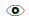
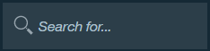

---

copyright:
  years: 2015, 2017
lastupdated: "2017-05-26"

---

{:new_window: target="_blank"}
{:shortdesc: .shortdesc}
{:screen:.screen}
{:codeblock:.codeblock}

# Viewing and editing translations
{: #edittranslations}

The {{site.data.keyword.GlobalizationPipeline_short}} service provides human post-translation editing capabilities. You can edit to improve the quality or consistency of the translation or to substitute preferred wording. For example, you might want to overwrite the translation of a product name.

To view and edit the translations for a target language:

1. From the **Bundle details** page, select a target language or click the **View the translations** icon  from the Actions column.
2. The translations are presented in a table that shows key, source, and translation information.
 * **Key:** Represents an attribute in the resource file that has an associated value.
 * **Source:** Represents a translatable string that was included in the uploaded resource file.
 * **Translation:** Represents the translated version of a source value.
3. In the Actions column, click the **Modify the translation** icon  to edit a machine-translated value.
4. Edit the translation and click **Update** to update the original translated value with your edit.

 

***Tip:*** 
1. When you work with large bundles that include many translatable keys, finding a particular value might be difficult. On the target language translation page, you can quickly search across all keys, source, and translations using the **Search for...** box.
 

2. {{site.data.keyword.GlobalizationPipeline_short}} dashboard provides string filter function for you to select what kind of strings to show when you wan to view bundle details. Click on the default **Show all strings** tab, you can choose from showing all strings, reviewed strings only , or unreviewed strings only.

