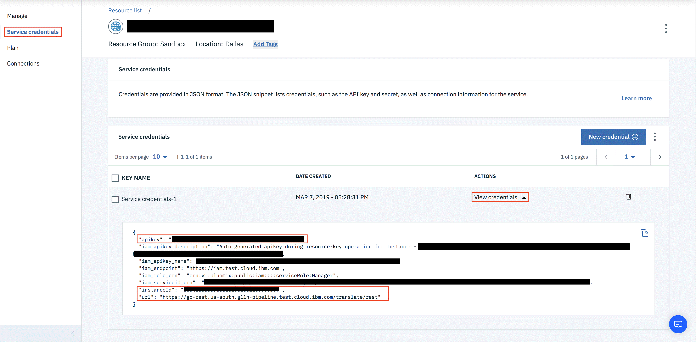

---

copyright:
  years:  2015, 2019
lastupdated: "2019-07-02"

---

{:new_window: target="_blank"}
{:shortdesc: .shortdesc}
{:screen: .screen}
{:pre: .pre}
{:table: .aria-labeledby="caption"}
{:codeblock: .codeblock}
{:tip: .tip}
{:download: .download}


# IBM Cloud IAM for {{site.data.keyword.GlobalizationPipeline_short}}
{: #gp_iam}

## Access
{: #gp_iam_access}
Access to {{site.data.keyword.GlobalizationPipeline_short}} RC enabled service instances for users in your account is controlled by {{site.data.keyword.Bluemix_notm}} Identity and Access Management (IAM) and/or {{site.data.keyword.GlobalizationPipeline_short}} Authentication. Whereas for CF instances only {{site.data.keyword.GlobalizationPipeline_short}} Authentication can be used.

## {{site.data.keyword.GlobalizationPipeline_short}} authentication
{: #gp_iam_ca}
To use the authentication mechanism, see [Add API users](/docs/services/GlobalizationPipeline/managetranslations.html#adduser).


## Identity Access Management (IAM)
{: #gp_iam_ovw}
Every user that accesses the {{site.data.keyword.GlobalizationPipeline_short}} service in your account must be assigned an access policy with an IAM user role defined. That policy determines what actions the user can perform within the context of the service or instance you select. The allowable actions are customized and defined by the {{site.data.keyword.Bluemix_notm}} service as operations that are allowed to be performed on the service. The actions are then mapped to IAM user roles.

Policies enable access to be granted at different levels. Some of the options include the following:

* Access across all instances of the service in your account
* Access to an individual service instance in your account
* Access to a specific resource within an instance
* Access to all IAM-enabled services in your account

After you define the scope of the access policy, you assign a role. The following table details actions that are mapped to service access roles. Service access roles enable users access to {{site.data.keyword.GlobalizationPipeline_short}} as well as the ability to call the {{site.data.keyword.GlobalizationPipeline_short}}’s API.

| **Role type** | **View translations** | **Edit translations** | **Modify bundle information** | **Create professional translation requests** | **View professional translation requests** |
|---------------|-----------------------|-----------------------|-------------------------------|----------------------------------------------|--------------------------------------------|
| Reader        | Yes | No | No | No | No |
| Writer        | Yes | Yes | No | No | Yes |
| Manager       | Yes | Yes | Yes | Yes | Yes |
{: caption="Table 1. IAM user roles and actions" caption-side="top"}

Currently, IAM users are granted access at the service instance level, and IAM users cannot be be allowed or denied access at the bundle level. For fine-grained control, use {{site.data.keyword.GlobalizationPipeline_short}} Authentication.

For information about assigning user roles in the UI, see [Managing IAM access](/docs/iam?topic=iam-iammanidaccser).

### Generating API calls
{: #gp_iam_apicalls}

To generate or to get the service credentials, follow the following steps.
1. Log on to your {{site.data.keyword.Bluemix}} account in [{{site.data.keyword.Bluemix}} dashboard](https://cloud.ibm.com/).
2. Click the service instance in [{{site.data.keyword.Bluemix}} dashboard](https://cloud.ibm.com/).
3. Click **Service credentials** to open your service instance.
4. Click **New Credential** to follow the prompt to create new credentials.
5. Click **View credentials** after creating the credential.


The following are examples of calling {{site.data.keyword.GlobalizationPipeline_short}}'s API using IAM authentication.

* Using IAM bearer token
```
curl -X GET \
  https://gp-rest.us-south.g11n-pipeline.test.cloud.ibm.com/translate/rest/50341556337c581c208188ff8908ebc7/v2/bundles \
  -H 'Authorization: Bearer eyJjsksd…w'
```

* Using API key
```
curl -X GET \
  https://gp-rest.us-south.g11n-pipeline.test.cloud.ibm.com/translate/rest/50341556337c581c208188ff8908ebc7/v2/bundles \
  -H 'Authorization: API-KEY MklfrP…ACem'
```
In the previous example, you can get the following information:
* “50341556337c581c208188ff8908ebc7” is the instanceId (from credentials section)
* “https://gp-rest.us-south.g11n-pipeline.test.cloud.ibm.com/translate/rest” is the url (from credentials section)
* “MklfrP…ACem” is the apikey (from credentials section)
* “eyJjsksd…w” is the IAM bearer token

For instructions to get IAM bearer token from apikey see [Getting an {{site.data.keyword.Bluemix_notm}} IAM token by using an API key](/docs/iam?topic=iam-iamtoken_from_apikey#iamtoken_from_apikey).
