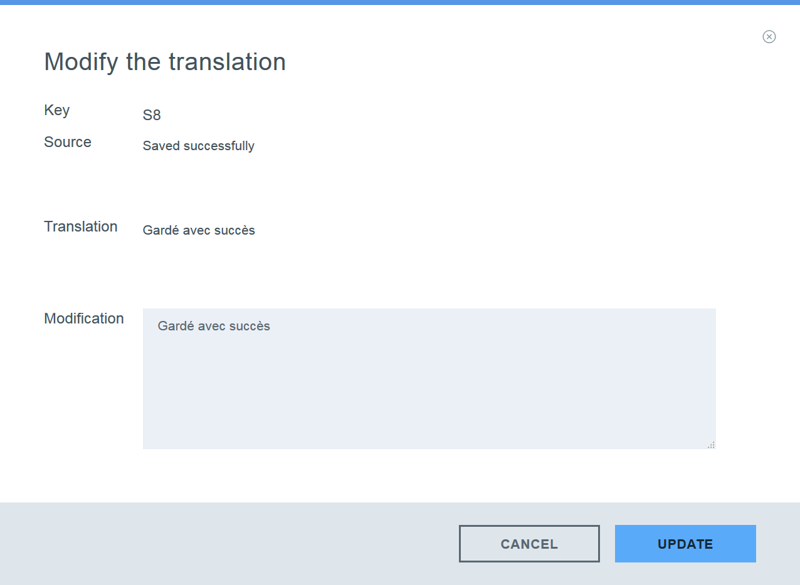
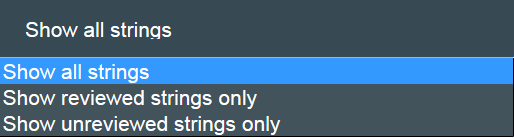
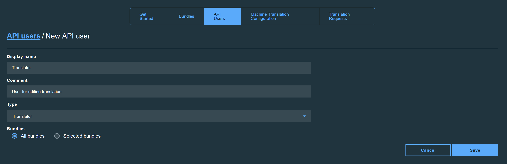

---

copyright:
  years: 2015, 2017
lastupdated: "2017-06-1"

---

{:new_window: target="_blank"}
{:shortdesc: .shortdesc}
{:screen:.screen}
{:codeblock:.codeblock}

# Managing bundle translations
{: #managetranslations}

Once you have created bundles and started generating translations for your application, you can choose from machine translation and human translation. The machine generated content can be used as is or further modified. You can also choose to use a machine translation other than the default. This section describes how to change the machine translation engine that performs the translations for your bundles, how to perform human post-translation editing, how to create human translation request, and also how you can assign user roles and access restrictions to the people that will need to access to your translations.

**Note**: The human translation request is only available for professional plan users. 

## Machine translation configuration
{: #machineconfig}

{{site.data.keyword.GlobalizationPipeline_full}} supports the ability to integrate alternative machine translation services to perform the machine translation for your bundles. Adding an alternative service can be beneficial if the default engine utilized by {{site.data.keyword.GlobalizationPipeline_short}} does not offer a specific language that you need or if you prefer the machine translations that are generated by a different engine. Use of and charges for alternative services are covered under the terms of those services.

To add and configure an alternative machine translation service for {{site.data.keyword.GlobalizationPipeline_short}}, select the **Machine Translation Configuration** tab from the {{site.data.keyword.GlobalizationPipeline_short}} dashboard.

* To add a machine translation service that is in the {{site.data.keyword.Bluemix_notm}} catalog, (**Watson Language Translator**), the service must first be added to your {{site.data.keyword.Bluemix_notm}} space.

* To add a third party service, select the button for that service on the **Machine Translation Configuration** tab and provide the user credentials required to access the service.

After a machine translation service has been added to {{site.data.keyword.GlobalizationPipeline_short}}, complete the remaining steps to complete the integration of that service.

1. Click **Enable** to turn on the integration with that service.

2. Click **Update Languages** to view the an updated list of supported target languages.

3. From the list of target languages, select the machine translation engine which should perform the translation.

4. Click **Save** to return to the **Machine Translation Configuration** tab.

Once an alternative service has been configured with {{site.data.keyword.GlobalizationPipeline_short}}, all target languages that have been assigned to that engine will begin to be generated using that engine. 

To stop using an alternative machine translation engine:

1. From the **Machine Translation Configuration** tab, click the **Disable** button for the service you want to stop using.

Once an alternative machine translation service is disabled, all translations that have been generated by the service will remain within your bundles. However, translation into a particular target language many not be available for future updates if the target language is no longer supported by the machine translation engine that is currently enabled.

<!-- Review comment: When you disable an engine, do you need to go back and reconfigure the languages?? Does it go back to the default engine? What happens? -->

## Viewing and editing translations
{: #edittranslations}

The {{site.data.keyword.GlobalizationPipeline_short}} service provides human post-translation editing capabilities. You can edit to improve the quality or consistency of the translation or to substitute preferred wording. For example, you might want to overwrite the translation of a product name.

To view and edit the translations for a target language:

1. From the **Bundle details** page, select a target language or click the **View the translations** icon  from the Actions column.
2. The translations are presented in a table that shows key, source, and translation information.
 * **Key:** Represents an attribute in the resource file that has an associated value.
 * **Source:** Represents a translatable string that was included in the uploaded resource file.
 * **Translation:** Represents the translated version of a source value.
3. In the Actions column, click the **Modify the translation** icon  to edit a machine-translated value.
4. Edit the translation and click **Update** to update the original translated value with your edit.

 

***Tip:*** 
1. When you work with large bundles that include many translatable keys, finding a particular value might be difficult. On the target language translation page, you can quickly search across all keys, source, and translations using the **Search for...** box.
 

2. {{site.data.keyword.GlobalizationPipeline_short}} dashboard provides string filter function for you to select what kind of strings to show when you wan to view bundle details. Click on the default **Show all strings** tab, you can choose from showing all strings, reviewed strings only , or unreviewed strings only.

## Creating chargeable human translation requests
{: #humantranslation}

Where quality over speed is paramount, you may wish to engage professional translators to review your machine translation. For an additional charge in the professional plan of {{site.data.keyword.GlobalizationPipeline_short}}, you are able to submit your machine translated bundles for human review and editing. To do this, you switch from the standard plan to the professional plan, create a human translation request and send your target bundles to IBM's professional translation services. You can use this capability to further refine the quality and consistency of your translations. Languages that are available for human review and editing are the same as the languages supported by the machine translation engines available through {{site.data.keyword.GlobalizationPipeline_short}}. 

To create a human translation request, complete the following steps: 

1. Switch to **Professional plan** of {{site.data.keyword.GlobalizationPipeline_short}}.

2. Click the **Translation request** tab on the dashboard, and click **New Request**.

3. Select your target bundle and target languages for translation. 

4. Verify the bundle ID, target languages and source wordcount for translation. 

5. Provide necessary information about your request. Fields that are marked with asterisks must be filled in.

6. Confirm and submit the request.

**Note**: There are 5 states of each translation request. You can refer to the following table to help track the status of your translation request.

| Status | Email notification | Status explanation |
|--------|--------------------|--------------------|
| Draft  | No | The translation request is created but not submitted yet. You can still modify the content of the translation request. |
| Submitted | Yes | The translation request is submitted, and you cannot modify the content of the translation request. |
| Editing started | Yes | The human post editing work of the translation request is started. |
| Editing Finished | Yes | The human post editing work of the translation request is finished. Still need to wait for the translated strings to be merged back to the master resource strings. |
| Merged | Yes | The human post editing result is merged back to the master resource strings. The translation request is finished. You can generate a report at this point.|

To generate a *JSON (.json)* report or XLIFF for your request, click the **View the request detail** icon  from the **Actions** column.  

**Note**: You can still view your human translation request data within a standard plan, but you can only create human translation request when you are a professional plan user of {{site.data.keyword.GlobalizationPipeline_short}}.

## Add API users
{: #adduser}

As you manage your translations, you may wish to grant access to additional API users based on the tasks they need to perform. For example, you may want to enable a translator to edit the translation, but not be able to modify the bundle information.

| Role type | View translations? | Edit translations? | Modify bundle information? |
|-----------|--------------------|--------------------|----------------------------|
| Reader | Yes | No | No |
| Translator | Yes | Yes | No |
| Administrator | Yes | Yes | Yes |

If you create more API users, you can restrict their access to one or more specific bundles, or grant them access to all of the available bundles.

To grant an API user access to bundles in a {{site.data.keyword.GlobalizationPipeline_short}} service instance:

1. On the {{site.data.keyword.GlobalizationPipeline_short}} dashboard, click the ** API Users** tab.
2. Click **New API User**.
3. Type a **display name** and **comment** to describe the new API user.
4. Choose a **type** for the new API user.
5. Choose to give the API user access to all bundles or only selected bundles.
6. Click **Save**.

An API user ID and password are generated and displayed. Copy and save those credentials; after you close the window, you cannot access them again. The credentials can be used for RESTful service via [SDKs](https://github.com/IBM-Bluemix/gp-common). 

To reset the API user password:

1. On the {{site.data.keyword.GlobalizationPipeline_short}} dashboard, click the **API Users** tab.
2. Click the **Reset Password** icon  to reset password for a specific user ID. 
3. Click **Yes**. 
