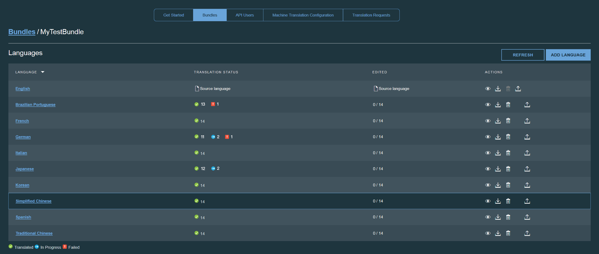

---

copyright:
  years: 2015, 2018
lastupdated: "2017-07-19"

---

{:new_window: target="_blank"}
{:shortdesc: .shortdesc}
{:screen:.screen}
{:codeblock:.codeblock}

# Modifying bundle details
{: #modifybundles}

When you open a bundle you can view all of the details about it. All of the target languages that are in the bundle are listed, along with the current translation status for each.

The status for each language in the bundle can be In Progress, Failed, or Translated:

| Status | Description |
|--------|-------------|
| In Progress | Machine translation is still in progress. |
| Failed | An error occurred while the resource file was being translated into the target language. |
| Translated | The translation to the target language is complete. |

You can update the resource file that the bundle uses, add a target language to a bundle, delete a target language from a bundle, and download the generated translations for a target language.

## Updating the resource file used by the bundle

1. Next to the source language, click the **Upload resources** icon  in the Actions column.
2. Click **Browse** and select the new resource file to upload.
3. Select the type of resource file that you are uploading
 * Java Properties file
 * AMD I18N
 * JSON
4. Click **Update** to upload the new resource file.

The key/value pairs that are in the new or updated resource file are synchronized with the values that were already uploaded. Only content that is new or changed will be translated.

## Adding a target language to a bundle

1. Click the **Add Language** button.
2. All available target languages are shown. Select the languages to add to the bundle.

Translation for the selected languages will begin immediately.

## Deleting a target language from a bundle

When you delete a target language from a bundle, you remove the target language and all associated translations from the project. In the Actions column of the target language to remove, click the **Remove this target language** icon .

## Downloading the generated translations for a target language

{{site.data.keyword.GlobalizationPipeline_short}} provides several ways to incorporate the translation for a target language into your application. You can download the translation as a resource file and include it in your application build. You can also reference the translation dynamically from {{site.data.keyword.GlobalizationPipeline_short}} using one of the open source [SDKs](https://github.com/IBM-Bluemix/gp-common). 

<!-- For information on {{site.data.keyword.GlobalizationPipeline_full}} SDKs, see <link>. -->

To download the translation as a resource file: 

1. In the **Actions** column of the target or source language to download, click the **Download the translations** icon .
2. Select a file format.
3. Click **Download**.
