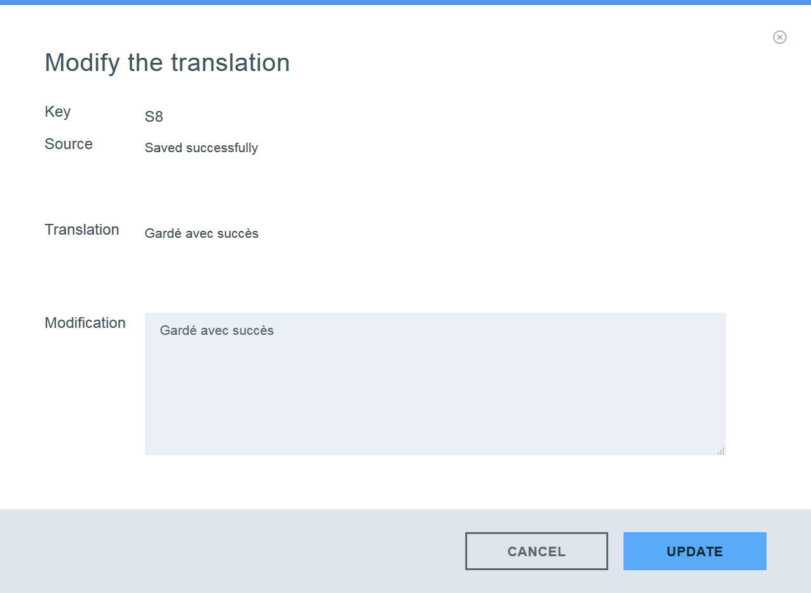
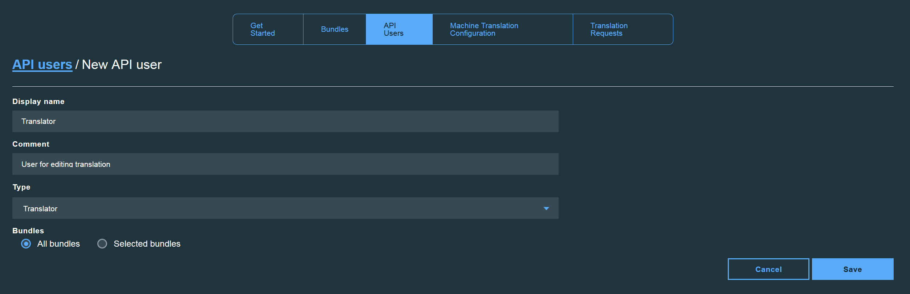

---

copyright:
  years: 2015, 2018
lastupdated: "2017-06-21"

---

{:new_window: target="_blank"}
{:shortdesc: .shortdesc}
{:screen:.screen}
{:codeblock:.codeblock}

# Übersetzungen verwalten
{: #managetranslations}

Wenn Sie Bundles erstellt und mit der Generierung von Übersetzungen für Ihre Anwendung begonnen haben, können Sie zwischen automatischer Übersetzung und Humanübersetzung wählen. Der automatisch generierte Inhalt kann unverändert übernommen oder zusätzlich geändert werden. Sie können auch auswählen, dass Sie eine andere automatische Übersetzung als den Standard verwenden möchten. Dieser Abschnitt enthält Anweisungen für die folgenden Tasks:
<ul>
<li>Ändern der Engine für die automatische Übersetzung, mit der die Übersetzungen für Ihre Bundles durchgeführt werden</li>
<li>Bearbeitung durch einen Humanübersetzer im Anschluss an die automatische Übersetzung</li>
<li>Erstellen einer Anforderung für eine Humanübersetzung</li>
<li>Zuweisen von Benutzerrollen und Zugriffsbeschränkungen zu den Personen, die Zugriff auf Ihre Übersetzungen benötigen</li>
</ul>

**Hinweis**: Benutzer eines Standardplans können zu einem Professional-Plan wechseln, wenn sie eine Anforderung für eine Humanübersetzung erstellen möchten. Innerhalb eines Standardplans ist es weiterhin möglich, die Daten der Anforderung für eine Humanübersetzung anzuzeigen, das Anfordern einer Humanübersetzung steht nur Benutzern eines Professional-Plans zur Verfügung.

## Konfiguration der Maschinenübersetzung
{: #machineconfig}

{{site.data.keyword.GlobalizationPipeline_full}} unterstützt die Fähigkeit zur Integration alternativer Services für automatische Übersetzung, um automatische Übersetzungen für Ihre Bundles auszuführen. Das Hinzufügen eines alternativen Service kann vorteilhaft sein, wenn die von {{site.data.keyword.GlobalizationPipeline_short}} verwendete Standard-Engine eine bestimmte Sprache, die Sie benötigen, nicht anbietet oder wenn Sie automatische Übersetzungen bevorzugen, die von einer anderen Engine generiert wurden. Die Verwendung von und die Gebühren für alternative Services werden unter den Bedingungen des jeweiligen Service aufgeführt.

Um einen alternativen Service für automatische Übersetzung für {{site.data.keyword.GlobalizationPipeline_short}} hinzuzufügen und zu konfigurieren, wählen Sie die Registerkarte **Automatische Übersetzung - Konfiguration** im {{site.data.keyword.GlobalizationPipeline_short}}-Dashboard aus.

* Um einen Service für automatische Übersetzung hinzuzufügen, der sich im {{site.data.keyword.Bluemix_notm}}-Katalog befindet, (**Watson Language Translator**), muss der Service zuerst zu Ihrem {{site.data.keyword.Bluemix_notm}}-Bereich hinzugefügt werden.

* Um einen Service anderer Anbieter hinzuzufügen, wählen Sie die Schaltfläche für diesen Service auf der Registerkarte **Automatische Übersetzung - Konfiguration** aus und stellen die erforderliche Benutzerberechtigung für den Zugriff auf den Service bereit.

Nachdem der Service für automatische Übersetzung zu {{site.data.keyword.GlobalizationPipeline_short}} hinzugefügt wurde, führen Sie die verbleibenden Schritte aus, um die Integration dieses Service abzuschließen.

1. Klicken Sie auf **Aktivieren**, um die Integration dieses Service zu aktivieren.

2. Klicken Sie auf **Sprachen aktualisieren**, um die aktualisierte Liste der unterstützten Zielsprachen anzuzeigen.

3. Wählen Sie in der Liste der Zielsprachen die Engine für automatische Übersetzung aus, die die Übersetzung ausführen soll.

4. Klicken Sie auf **Speichern**, um zur Registerkarte **Automatische Übersetzung - Konfiguration** zurückzukehren.

Sobald ein alternativer Service für {{site.data.keyword.GlobalizationPipeline_short}} konfiguriert wurde, werden alle Zielsprachen, die dieser Engine zugeordnet wurden, mithilfe der Engine generiert.

Gehen Sie wie folgt vor, um die Verwendung der alternativen Engine für automatische Übersetzung zu stoppen:

1. Klicken Sie auf der Registerkarte **Automatische Übersetzung - Konfiguration** für den Service, dessen Verwendung Sie stoppen möchten, auf die Schaltfläche **Inaktivieren**.

Wenn ein alternativer Service für automatische Übersetzung inaktiviert wurde, verbleiben alle Übersetzungen, die von diesem Service generiert wurden, innerhalb Ihrer Bundles. Die Übersetzung in eine bestimmte Zielsprache ist jedoch für künftige Updates möglicherweise nicht mehr verfügbar, wenn die Zielsprache nicht mehr von der Engine für automatische Übersetzung unterstützt wird, die dann aktiviert ist.

<!-- Review comment: When you disable an engine, do you need to go back and reconfigure the languages?? Does it go back to the default engine? What happens? -->

## Übersetzungen anzeigen und bearbeiten
{: #edittranslations}

Der {{site.data.keyword.GlobalizationPipeline_short}}-Service bietet nach der Übersetzung Bearbeitungsmöglichkeiten durch Humanübersetzer an. Sie können durch die Bearbeitung die Qualität oder Konsistenz der Übersetzung verbessern oder bevorzugte Schreibungen ersetzen. Sie möchten zum Beispiel möglicherweise die Übersetzung eines Produktnamens überschreiben.

Gehen Sie wie folgt vor, um die Übersetzungen für eine Zielsprache anzuzeigen und zu bearbeiten:

1. Wählen Sie auf der Seite **Bundledetails** eine Zielsprache aus oder klicken Sie auf das Symbol **Übersetzungen anzeigen**  in der Aktionsspalte aus.
2. Die Übersetzungen werden in einer Tabelle dargestellt, die Schlüssel, Quelle und Übersetzungsinformationen anzeigt.
 * **Schlüssel:** Stellt ein Attribut in der Ressourcendatei mit einem zugeordneten Wert dar.
 * **Quelle: ** Stellt eine übersetzbare Zeichenfolge dar, die in die hochgeladene Ressourcendatei integriert wurde.
 * **Übersetzung:** Stellt die übersetzte Version eines Quellenwerts dar.
3. Klicken Sie in der Aktionsspalte auf das Symbol **Übersetzung ändern** , um einen automatisch übersetzten Wert zu bearbeiten.
4. Bearbeiten Sie die Übersetzung und klicken Sie auf **Aktualisieren**, um den ursprünglich übersetzten Wert durch Ihre Bearbeitung zu aktualisieren.

***Tipp:***
1. Wenn Sie mit großen Bundles arbeiten, die zahlreiche übersetzbare Schlüssel enthalten, kann das Suchen nach einem bestimmten Wert schwierig sein. Auf der Seite mit den Zielsprachenübersetzungen können Sie schnell über alle Schlüssel, Quellen und/oder Übersetzungen hinweg suchen, indem Sie das Feld **Suchen nach....** verwenden.

2. Das {{site.data.keyword.GlobalizationPipeline_short}}-Dashboard stellt eine Zeichenfolgefilterfunktion bereit, mit der Sie auswählen können, welche Zeichenfolgen beim Anzeigen von Bundledetails dargestellt werden sollen. Die Standardregisterkarte ist **Alle Zeichenfolge anzeigen**; Sie können die Anzeige aller Zeichenfolgen, nur der überprüften Zeichenfolgen oder nur der nicht überprüften Zeichenfolgen auswählen.

## Gebührenpflichtige Anforderungen für Humanübersetzungen erstellen
{: #humantranslation}

Wo es in besonderem Maße auf Qualität ankommt, können Sie Humanübersetzer damit beauftragen, die automatische Übersetzung zu überprüfen. Gegen eine zusätzliche Gebühr im Rahmen des Professional-Plans von {{site.data.keyword.GlobalizationPipeline_short}} können Sie die automatisch übersetzten Bundles zur Überprüfung und Bearbeitung durch einen Humanübersetzer übergeben. Hierzu müssen Sie vom Standardplan zum Professonal-Plan wechseln, eine Anforderung für eine Humanübersetzung erstellen und die Zielbundles an die Humanübersetzungsservices von IBM übergeben. Sie können diese Möglichkeit nutzen, um die Qualität und Konistenz Ihrer Übersetzungen zu optimieren. Die Sprachen, die für die Überprüfung und Bearbeitung durch einen Humanübersetzer verfügbar sind, sind dieselben, die auch von den Engines zur automatischen Übersetzung unterstützt werden, die mit {{site.data.keyword.GlobalizationPipeline_short}} bereitgestellt werden.

Führen Sie die folgenden Schritte aus, um eine Übersetzungsanforderung zu erstellen:

1. Wechseln Sie zum **Professional-Plan von {{site.data.keyword.GlobalizationPipeline_short}}**.

2. Klicken Sie auf die Registerkarte **Übersetzungsanforderung** im Dashboard und klicken Sie dann auf **Neue Anforderung**.

3. Wählen Sie das Zielbundle und die Zielsprachen für die Übersetzung aus.

4. Überprüfen Sie die Bundle-ID, die Zielsprachen und die Anzahl der Wörter im Quellentext.

5. Geben Sie die erforderlichen Informationen zu Ihrer Anforderung an. Felder, die mit einem Stern gekennzeichnet sind, müssen ausgefüllt werden.

6. Bestätigen und übergeben Sie die Anforderung.

**Hinweis**: Es wird dringend empfohlen, in Schritt 5 zusätzlichen Kontext für den Übersetzungsinhalt im Feld **Spezielle Anweisungen** anzugeben. Dies vermittelt Humanübersetzern ein besseres Verständnis des Inhalts und ermöglicht bessere Übersetzungsergebnisse.

Über das Dashboard können Sie alle Übersetzungsanforderungen anzeigen und den Status verfolgen.

**Hinweis**: Jede Übersetzungsanforderung kann 5 Status aufweisen. Verwenden Sie die folgende Tabelle als Referenz, um den Status Ihrer Übersetzungsanforderung zu verfolgen.

| Status | E-Mail-Benachrichtigung | Erläuterung zum Status |
|--------|--------------------|--------------------|
| Entwurf  | Nein | Die Übersetzungsanforderung wurde erstellt, jedoch noch nicht übergeben. Es ist noch möglich, den Inhalt der Übersetzungsanforderung zu ändern oder die Übersetzungsanforderung zu löschen. |
| Übergeben | Ja | Die Übersetzungsanforderung wurde übergeben und ihr Inhalt kann nicht mehr geändert werden. |
| Bearbeitung gestartet | Ja | Die Nachbearbeitung der Übersetzungsanforderung durch den Humanübersetzer wurde gestartet. |
| Bearbeitung fertiggestellt | Ja | Die Nachbearbeitung der Übersetzungsanforderung durch den Humanübersetzer wurde fertiggestellt. Sie müssen noch warten, bis die übersetzten Zeichenfolgen wieder mit den Masterressourcenzeichenfolgen zusammengeführt wurden. |
| Zusammengeführt | Ja | Das Ergebnis der Nachbearbeitung durch den Humanübersetzer wurde mit den Masterressourcenzeichenfolgen zusammengeführt. Die Übersetzungsanforderung ist fertiggestellt. Zu diesem Zeitpunkt können Sie einen Bericht generieren. Sie können die Übersetzungsanforderung zu zukünftigen Referenzzwecken speichern oder löschen, um Speicherplatz zu sparen. Das Löschen der Übersetzungsanforderung hat keine Auswirkung auf die zusammengeführten Übersetzungsergebnisse. |

Wenn Sie Details zur Übersetzungsanforderung anzeigen möchten, klicken Sie auf das Symbol
**Anforderungsdetails anzeigen**  in der Spalte **Aktionen**.

Wenn Sie einen Bericht im *JSON-Format (.json)* oder eine XLIFF-Datei für Ihre Anforderung erstellen möchten, klicken Sie auf die Schaltfläche **Bericht herunterladen** oder **XLIFF herunterladen**.

## API-Benutzer hinzufügen
{: #adduser}

Bei der Verwaltung Ihrer Übersetzungen möchten Sie möglicherweise weiteren API-Benutzern, auf Grundlage der von ihnen auszuführenden Aufgaben, Zugriff gewähren. Sie möchten beispielsweise einem Übersetzer ermöglichen, die Übersetzung zu bearbeiten, dieser soll jedoch nicht die Bundle-Information ändern können.

| **Rollentyp** | **Übersetzungen anzeigen** | **Übersetzungen bearbeiten** | **Bundle-Informationen ändern** | **Anforderungen für professionelle Übersetzung erstellen** | **Anforderungen für professionelle Übersetzung anzeigen** |
|-----------|--------------------|--------------------|----------------------------|
| Leser     | Ja | Nein | Nein | Nein | Nein |
| Übersetzer | Ja | Ja | Nein | Nein | Ja |
| Administrator | Ja | Ja | Ja | Ja | Ja |

Wenn Sie mehr API-Benutzer erstellen, können Sie deren Zugriff auf ein oder mehrere spezifische Bundles einschränken oder ihnen Zugriff auf alle verfügbaren Bundles gewähren, indem Sie die {{site.data.keyword.GlobalizationPipeline_short}}-Authentifizierung nutzen. 

Gehen Sie wie folgt vor, um einem API-Benutzer Zugriff auf ein Bundle in einer Serviceinstanz von {{site.data.keyword.GlobalizationPipeline_short}} zu gewähren:

1. Klicken Sie im {{site.data.keyword.GlobalizationPipeline_short}}-Dashboard auf die Registerkarte **API-Benutzer**.
2. Klicken Sie auf **Neuer API-Benutzer**.
3. Geben Sie einen **Anzeigenamen** und einen **Kommentar** zur Beschreibung des neuen API-Benutzers ein.
4. Wählen Sie einen **Typ** für den neuen API-Benutzer aus.
5. Wählen Sie aus, dass der API-Benutzer Zugriff auf alle Bundles oder nur auf ausgewählte Bundles haben soll.
6. Klicken Sie auf **Speichern**.

Eine API-Benutzer-ID und ein Kennwort werden generiert und angezeigt. Kopieren und speichern Sie diese Berechtigungsnachweise. Nachdem Sie das Fenster geschlossen haben, können Sie nicht mehr auf diese Daten zugreifen. Die Berechtigungsnachweise können für den RESTful-Service über [SDKs](https://github.com/IBM-Bluemix/gp-common) verwendet werden.

Gehen Sie wie folgt vor, um das API-Benutzerkennwort zurückzusetzen:

1. Klicken Sie im {{site.data.keyword.GlobalizationPipeline_short}}-Dashboard auf die Registerkarte **API-Benutzer**.
2. Klicken Sie auf das Symbol **Kennwort zurücksetzen** , um das Kennwort für eine bestimmte Benutzer-ID zurückzusetzen.
3. Klicken Sie auf **Ja**.
