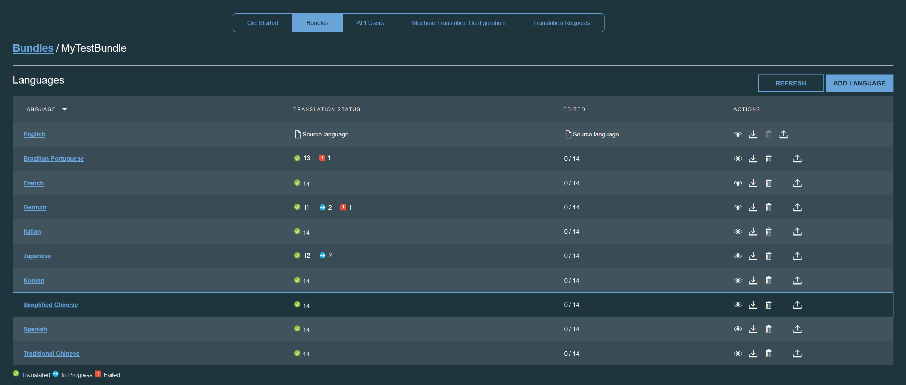

---

copyright:
  years: 2015, 2018
lastupdated: "2017-05-26"

---

{:new_window: target="_blank"}
{:shortdesc: .shortdesc}
{:screen:.screen}
{:codeblock:.codeblock}

# Modificación de detalles de paquetes
{: #modifybundles}

Cuando abra un paquete, puede ver todos los detalles sobre el mismo. Todos los idiomas de destino que se encuentran en el paquete están enumerados, junto con el estado de traducción actual para cada uno.

El estado para cada idioma del paquete puede ser En curso, Error o Traducido:

| Estado | Descripción |
|--------|-------------|
| En curso | La traducción automática aún está en curso. |
| Error | Se ha producido un error mientras que el archivo de recursos se estaba traduciendo al idioma de destino. |
| Traducido | La traducción al idioma de destino está completa. |

Puede actualizar el archivo de recursos que utiliza el paquete, añadir un idioma de destino a un paquete, suprimir un idioma de destino desde un paquete y descargar las traducciones generadas para un idioma de destino.

## Actualización del archivo de recursos utilizado por el paquete

1. Junto al idioma de origen, pulse el icono **Subir recursos**  en la columna Acciones.
2. Pulse **Examinar** y seleccione el nuevo archivo de recursos que se subirá.
3. Seleccione el tipo de archivo de recursos que está subiendo
 * Archivo Properties de Java
 * AMD I18N
 * JSON
4. Pulse **Actualizar** para subir el nuevo archivo de recursos.

Los pares clave/valor que se encuentran en el archivo de recursos nuevo o actualizado se sincronizarán con los valores que ya se han subido. Solo se traducirá el contenido que sea nuevo o modificado.

## Adición de un idioma de destino a un paquete

1. Pulse el botón **Añadir idioma**.
2. Se mostrarán todos los idiomas de destino disponibles. Seleccione los idiomas que desee añadir al paquete.

La traducción para los idiomas seleccionados comenzará inmediatamente.

## Supresión de un idioma de destino desde un paquete

Cuando se suprime un idioma de destino de un paquete, elimine el idioma de destino y todas las traducciones asociadas desde el proyecto. En la columna Acciones del idioma de destino que se va a eliminar, pulse el icono **Eliminar este idioma de destino** .

## Descarga de las traducciones generadas para un idioma de destino

{{site.data.keyword.GlobalizationPipeline_short}} proporciona varias formas de incorporar la traducción para un idioma de destino en la aplicación. Puede descargar la traducción como un archivo de recursos e incluirla en la compilación de la aplicación. También puede hacer referencia a la traducción de forma dinámica desde {{site.data.keyword.GlobalizationPipeline_short}} utilizando uno de los [SDK](https://github.com/IBM-Bluemix/gp-common) de código abierto. 

<!-- For information on {{site.data.keyword.GlobalizationPipeline_full}} SDKs, see <link>. -->

Para descargar la traducción como un archivo de recursos: 

1. En la columna **Acciones** del idioma de destino o de origen para descargar, pulse el icono **Descargar las traducciones** .
2. Seleccione un formato de archivo.
3. Pulse **Descargar**.
