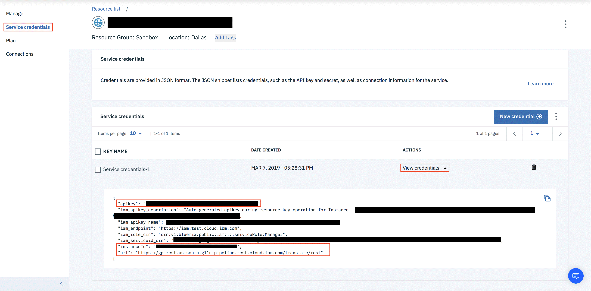

---

copyright:
  years:  2015, 2019
lastupdated: "2019-03-25"

---

{:new_window: target="_blank"}
{:shortdesc: .shortdesc}
{:screen: .screen}
{:pre: .pre}
{:table: .aria-labeledby="caption"}
{:codeblock: .codeblock}
{:tip: .tip}
{:download: .download}


# IBM Cloud IAM pour {{site.data.keyword.GlobalizationPipeline_short}}
{: #gp_iam}

## Accès
{: #gp_iam_access}
L'accès des utilisateurs aux instances de service {{site.data.keyword.GlobalizationPipeline_short}} activées par RC est contrôlé par {{site.data.keyword.Bluemix_notm}} IAM (Identity and Access Management) et/ou par l'authentification {{site.data.keyword.GlobalizationPipeline_short}}. Cependant, pour les instances Cloud Foundry, seule l'authentification {{site.data.keyword.GlobalizationPipeline_short}} peut être utilisée.

## Authentification {{site.data.keyword.GlobalizationPipeline_short}}
{: #gp_iam_ca}
Pour utiliser le mécanisme d'authentification, voir [Ajout d'utilisateurs d'API](/docs/services/GlobalizationPipeline/managetranslations.html#adduser).


## IAM (Identity Access Management)
{: #gp_iam_ovw}
Une règle d'accès avec un rôle utilisateur IAM doit être affectée à chaque utilisateur disposant d'un accès au service {{site.data.keyword.GlobalizationPipeline_short}} dans votre compte. Cette règle détermine les actions que l'utilisateur peut effectuer dans le contexte du service ou de l'instance que vous sélectionnez.
Les actions autorisées sont personnalisées et définies par le service {{site.data.keyword.Bluemix_notm}} en tant qu'opérations pouvant être réalisées sur le service. Les actions sont ensuite mappées à des rôles utilisateur IAM.

Les règles permettent d'activer différents niveaux d'accès. Certaines des options sont les suivantes :

* Accès à toutes les instances du service dans votre compte
* Accès à une instance de service individuelle de votre compte
* Accès à une ressource spécifique dans une instance
* Accès à tous les services activés par IAM dans votre compte

Après avoir défini la portée de la règle d'accès, vous lui affectez un rôle. Le tableau suivant détaille les actions qui sont mappées aux rôles d'accès au service. Les rôles d'accès au service permettent aux utilisateurs d'accéder à {{site.data.keyword.GlobalizationPipeline_short}} et également d'appeler l'API de {{site.data.keyword.GlobalizationPipeline_short}}.

| **Type de rôle** | **Afficher des traductions** | **Editer des traductions** | **Modifier des informations de bundle** | **Créer des demandes de traduction professionnelle** | **Afficher des demandes de traduction professionnelle** |
|---------------|-----------------------|-----------------------|-------------------------------|----------------------------------------------|--------------------------------------------|
| Lecteur        | Oui | Non | Non | Non | Non |
| Auteur        | Oui | Oui | Non | Non | Oui |
| Responsable       | Oui | Oui | Oui | Oui | Oui |
{: caption="Tableau 1. Actions et rôles utilisateur IAM" caption-side="top"}

Actuellement, vous pouvez accorder aux utilisateurs IAM l'accès au niveau instance de service mais vous ne pouvez pas leur accorder ou leur refuser l'accès au niveau bundle. Pour un contrôle à granularité fine, utilisez l'authentification {{site.data.keyword.GlobalizationPipeline_short}}.

Pour plus d'informations sur l'affectation de rôles utilisateur dans l'interface utilisateur, voir [Gestion de l'accès IAM](/docs/iam/iammanidaccser.html#iammanidaccser).

### Génération d'appels d'API
{: #gp_iam_apicalls}

Pour générer ou obtenir des données d'identification de service, procédez comme suit :
1. Connectez-vous à votre compte {{site.data.keyword.Bluemix}} dans le [tableau de bord {{site.data.keyword.Bluemix}}](https://cloud.ibm.com/).
2. Cliquez sur l'instance de service dans le [tableau de bord {{site.data.keyword.Bluemix}}](https://cloud.ibm.com/).
3. Cliquez sur **Données d'identification pour le service** pour ouvrir votre instance de service. 
4. Cliquez sur **Nouvelles données d'identification** et suivez les instructions de création de nouvelles données d'identification.
5. Cliquez sur **Afficher les données d'identification** après les avoir créées.


Exemples d'appel d'API {{site.data.keyword.GlobalizationPipeline_short}} à l'aide de l'authentification IAM.

* Utilisation du jeton bearer d'IAM
```
curl -X GET \
  https://gp-rest.us-south.g11n-pipeline.test.cloud.ibm.com/translate/rest/50341556337c581c208188ff8908ebc7/v2/bundles \
  -H 'Authorization: Bearer eyJjsksd…w'
```

* Utilisation de la clé d'API
```
curl -X GET \
  https://gp-rest.us-south.g11n-pipeline.test.cloud.ibm.com/translate/rest/50341556337c581c208188ff8908ebc7/v2/bundles \
  -H 'Authorization: API-KEY MklfrP…ACem'
```
Avec l'exemple précédent, vous obtenez les informations suivantes :
* “50341556337c581c208188ff8908ebc7” est l'ID d'instance (issu de la section données d'identification)
* “https://gp-rest.us-south.g11n-pipeline.test.cloud.ibm.com/translate/rest” est l'URL (issue de la section données d'identification)
* “MklfrP…ACem” est la clé d'API (issue de la section données d'identification)
* “eyJjsksd…w” est le jeton bearer d'IAM

Pour les instructions d'obtention du jeton bearer IAM à partir d'une clé d'API, voir [Obtention d'un jeton IAM {{site.data.keyword.Bluemix_notm}} à l'aide d'une clé d'API](/docs/iam?topic=iam-iamtoken_from_apikey#iamtoken_from_apikey).
