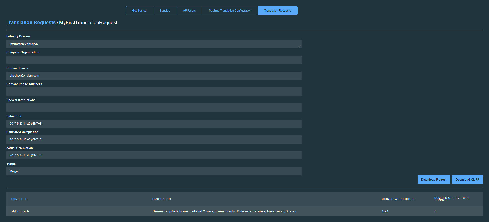

---

copyright:
  years: 2015, 2017
lastupdated: "2017-07-19"

---

{:new_window: target="_blank"}
{:shortdesc: .shortdesc}
{:screen:.screen}
{:codeblock:.codeblock}

# Gestion des traductions
{: #managetranslations}

Une fois que vous avez créé des bundles et commencé à générer des traductions pour votre application, vous pouvez choisir entre traduction automatique et traduction humaine. Le contenu généré automatiquement peut être utilisé tel quel ou être modifié. Vous pouvez également utiliser une traduction automatique autre que celle par défaut. Cette section couvre les instructions pour les tâches suivantes :
<ul>
<li>Comment changer le moteur de traduction automatique qui effectue la traduction de vos bundles ?</li>
<li>Comment effectuer une édition humaine post-traduction ?</li>
<li>Comment créer une demande de traduction humaine ?</li>
<li>Comment affecter des rôles utilisateur et des restrictions d'accès aux personnes qui auront besoin d'accéder à vos traductions ?
</li>
</ul>

**Remarque **: dans le cas d'un utilisateur du plan Standard, si vous désirez créer une demande de traduction humaine, vous devez basculer su le plan Professional. Vous pouvez toujours visualiser ls données de votre demande de traduction humaine depuis un plan Standard, mais celle-ci n'est disponible que pour les utilisateurs du plan Professional. 

## Configuration de la traduction automatique
{: #machineconfig}

{{site.data.keyword.GlobalizationPipeline_full}} prend en charge la possibilité d'intégrer d'autres services de traduction automatique afin d'effectuer la traduction automatique pour vos bundles. Il est pratique de pouvoir ajouter un autre service si le moteur utilisé par défaut par {{site.data.keyword.GlobalizationPipeline_short}} ne propose pas une langue dont vous avez besoin ou si vous préférez les traductions automatiques qui sont générées par un autre moteur. L'utilisation et les frais relatifs aux autres services sont traités dans la section sur les conditions d'utilisation de ces services.

Pour ajouter et configurer un autre service de traduction automatique pour {{site.data.keyword.GlobalizationPipeline_short}}, sélectionnez l'onglet **Machine Translation Configuration** du tableau de bord {{site.data.keyword.GlobalizationPipeline_short}}.

* Pour pouvoir ajouter un service de traduction automatique figurant dans le catalogue {{site.data.keyword.Bluemix_notm}} (**Watson Language Translator**), vous devez d'abord l'ajouter à votre espace {{site.data.keyword.Bluemix_notm}}.

* Pour ajouter un service tiers, sélectionnez le bouton correspondant à ce service sur l'onglet **Machine Translation Configuration** et indiquez les données d'identification de l'utilisateur requises pour accéder au service.

Après avoir ajouté un service de traduction automatique à {{site.data.keyword.GlobalizationPipeline_short}}, exécutez les étapes restantes pour finaliser l'intégration de ce service.

1. Cliquez sur **Enable** pour activer l'intégration à ce service.

2. Cliquez sur **Update Languages** pour visualiser la liste mise à jour des langues cible prises en charge.

3. Dans la liste des langues cible, sélectionnez le moteur de traduction automatique qui doit effectuer la traduction.

4. Cliquez sur **Save** pour revenir à l'onglet **Machine Translation Configuration**.

Une fois qu'un autre service a été configuré avec {{site.data.keyword.GlobalizationPipeline_short}}, toutes les langues cible qui ont été affectées à ce moteur commencent à être générées à l'aide de ce moteur. 

Pour cesser d'utiliser un autre moteur de traduction automatique :

1. Sur l'onglet **Machine Translation Configuration**, cliquez sur le bouton **Disable** pour le service que vous souhaitez cesser d'utiliser.

Une fois qu'un autre service de traduction est désactivé, toutes les traductions qu'il a générées sont conservées dans vos bundles. En revanche, il se peut que la traduction dans une langue cible donnée ne soit pas disponible pour des mises à jour ultérieures si cette langue cible n'est plus prise en charge par le moteur de traduction automatique qui est actuellement activé.

<!-- Review comment: When you disable an engine, do you need to go back and reconfigure the languages?? Does it go back to the default engine? What happens? -->

## Affichage et édition de traductions
{: #edittranslations}

Le service {{site.data.keyword.GlobalizationPipeline_short}} offre des fonctions d'édition humaine après traduction. L'édition permet d'améliorer la qualité ou la cohérence de la traduction ou d'effectuer des changements terminologiques. Par exemple, vous souhaiterez peut-être remplacer la traduction d'un nom de produit.

Pour afficher et éditer les traductions pour une langue cible :

1. Depuis la page **Bundle details**, sélectionnez une langue cible ou cliquez sur l'icône **View the translations**  dans la colonne Actions.
2. Les traductions sont présentées dans un tableau qui contient les informations de clé, de source et de traduction.
 * **Key :** Représente un attribut dans le fichier de ressources auquel une valeur est associée.
 * **Source :** Représente une chaîne susceptible d'être traduite qui a été incluse dans le fichier de ressources téléchargé.
 * **Translation :** Représente la version traduite d'une valeur source.
3. Dans la colonne Actions, cliquez sur l'icône **Modify the translation**  pour éditer une valeur traduite automatiquement.
4. Editez la traduction et cliquez sur **Update** pour mettre à jour la valeur traduite initialement avec votre modification.

 

***Astuce :*** 
1. Lorsque vous gérez des bundles volumineux comportant un grand nombre de clés susceptibles d'être traduites, il peut s'avérer difficile de trouver une valeur spécifique. Sur la page de traduction de langue cible, vous pouvez utiliser la zone **Search for...*** pour effectuer une recherche rapide portant sur toutes les clés, toutes les données source et toutes les traductions.   

2. Le tableau de bord {{site.data.keyword.GlobalizationPipeline_short}} fournit une fonction de filtrage de chaîne vous permettant de sélectionner le type de chaîne à afficher lorsque vous désirez examiner les détails du bundle. Cliquez sur l'onglet par défaut, **Show all strings**. Vous pouvez choisir d'afficher toutes les chaînes, celles révisées uniquement, ou celles non révisées uniquement.

## Création de demandes de traduction humaine facturables
{: #humantranslation}

Lorsque la qualité est primordiale, vous pouvez désirez retenir les services de traducteurs professionnels pour revoir votre traduction automatique. Pour un coût additionnel dans le plan Professional de {{site.data.keyword.GlobalizationPipeline_short}}, vous pouvez soumettre vos bundles traduits automatiquement pour leur revue pour leur revue et édition par un intervenant humain. Pour ce faire, passez du plan Standard au plan Professional, créez une demande de traduction humaine et soumettez vos bundles cible aux services de traduction professionnelle d'IBM. Vous pouvez utiliser cette possibulité pour affiner encore la qualité et la cohérence de vos traductions. Les langues disponibles pour revue et édition humaine sont les mêmes que celles prises en charge par les moteurs de traduction automatique disponibles via {{site.data.keyword.GlobalizationPipeline_short}}. 

Pour créer une demande de traduction procédez comme suit : 

1. Passez au Plan Professional de **{{site.data.keyword.GlobalizationPipeline_short}}**.

2. Cliquez sur l'onglet **Translation request** dans le tableau de bord et cliquez sur **New Request**.

3. Sélectionnez votre bundle et vos langues cibles pour la traduction. 

4. Vérifiez l'ID du bundle, les langues cible et le décompte des langues source pour traduction. 

5. Fournissez les informations nécessaires sur votre demande. Les zones signalées par des astérisques doivent être renseignées.

6. Confirmez et soumettez la demande.

**Remarque **: il est fortement recommandé de fournir des informations de contexte supplémentaires sur le contenu de votre traduction dans la zone **Special instruction** lors de l'étape 5. Ceci peut aider les traducteurs humains à mieux comprendre son contenu et don à livrer une traduction de qualité.

Vous pouvez examiner toutes vos demandes de traduction et suivre leur statut depuis le tableau de bord.

**Remarque **: chaque demande de traduction peuvent avoir 5 états. Vous pouvez vous reporter au tableau suivant pour suivi du statut de votre demande de traduction.

| Statut | Notification par courrier électronique | Explication du statut |
|--------|--------------------|--------------------|
| Draft (brouillon) | Non | La demande de traduction a été créée mais n'a pas encore été soumise. Vous pouvez encore modifier le contenu de la demande de traduction ou la supprimer. |
| Submitted (Soumise)| Oui | La demande de traduction a été soumise et vous ne pouvez plus modifier son contenu. |
| Editing started (Edition commencée)| Oui | Le travail de post-édition humaine de votre demande de traduction a commencé. |
| Editing Finished (Edition terminée)| Oui | Le travail de post-édition humaine de votre demande de traduction est terminé. Vous devez encore attendre la fusion des chaînes traduites dans les chaînes de la ressource maître. |
| Merged (Fusionnée)| Oui | Le résultat de la post-édition a été fusionné. Le traitement de la demande de traduction est terminé. A ce stade, vous pouvez générer un rapport pour référence future. Vous pouvez conserver la demande de tradiuction pour référence future ou bien la supprimer pour économiser de l'espace. La suppression de la demande de traduction n'affecte pas le résultat de la traduction fusionnée. |

Pour afficher les détails de la demande de traduction, cliquez sur l'icône **View the request detail**  dans la colonne **Actions**.

Pour générer un rapport *JSON (.json)* ou XLIFF pour votre demande, cliquez sur le bouton **Download Report** ou **Download XLIFF**.

## Ajout d'utilisateurs de l'API
{: #adduser}

A mesure que vous gérez vos traductions, vous souhaiterez peut-être octroyer un accès à d'autres utilisateurs d'API en fonction des tâches qu'ils doivent effectuer. Par exemple, vous souhaiterez peut-être permettre à un traducteur d'éditer la traduction, sans l'autoriser à modifier les informations de bundle.

| Type de rôle | Afficher les traductions ? | Editer les traductions ? | Modifier les informations de bundle ? |
|-----------|--------------------|--------------------|----------------------------|
| Lecteur | Oui | Non | Non |
| Traducteur | Oui | Oui | Non |
| Administrateur | Oui | Oui | Oui |

Si vous créez d'autres utilisateurs d'API, vous pouvez limiter leur accès à un ou plusieurs bundles donnés ou leur accorder un accès à tous les bundles disponibles.

Pour autoriser un utilisateur d'API à accéder aux bundles d'une instance de service {{site.data.keyword.GlobalizationPipeline_short}} :

1. Sur le tableau de bord {{site.data.keyword.GlobalizationPipeline_short}}, cliquez sur l'onglet **API Users**.
2. Cliquez sur **New API User**.
3. Saisissez un **nom d'affichage** et un **commentaire** pour décrire le nouvel utilisateur d'API.
4. Choisissez un **type** pour le nouvel utilisateur d'API.
5. Choisissez d'accorder un accès utilisateur à tous les bundles ou à certains bundles uniquement.
6. Cliquez sur **Save**.

Un ID et un mot de passe pour l'utilisateur d'API sont générés et affichés. Copiez et sauvegardez ces données d'identification, car agrès avoir fermé la fenêtre, vous n'aurez plus accès à ces informations. les données d'identification peuvent être utilisées pour le service RESTful via des [SDK](https://github.com/IBM-Bluemix/gp-common). 

Pour réinitialiser le mot de passe de l'utilisateur d'API :

1. Sur le tableau de bord {{site.data.keyword.GlobalizationPipeline_short}}, cliquez sur l'onglet **API Users**.
2. Cliquez sur l'icône **Reset Password**  pour réinitialiser le mot de passe d'un ID utilisateur spécifique. 
3. Cliquez sur **Yes**. 
