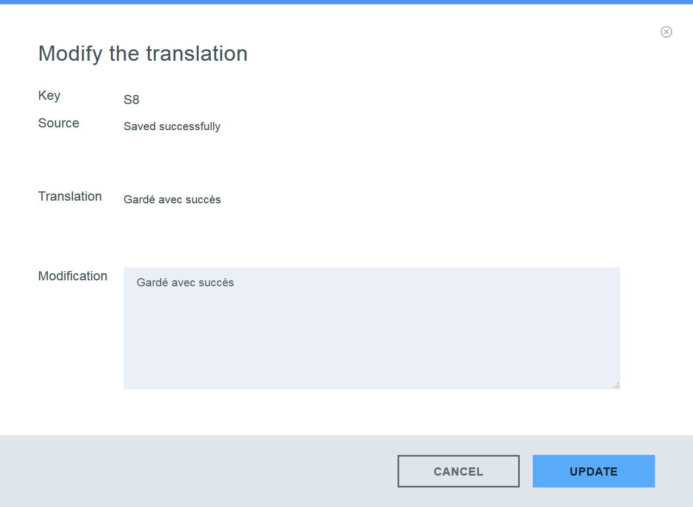
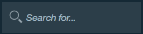
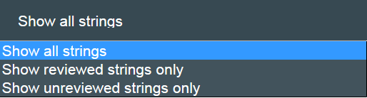

---

copyright:
  years: 2015, 2018
lastupdated: "2017-06-21"

---

{:new_window: target="_blank"}
{:shortdesc: .shortdesc}
{:screen:.screen}
{:codeblock:.codeblock}

# Gestione delle traduzioni
{: #managetranslations}

Dopo aver creato i bundle e avviato la generazione delle traduzioni per la tua applicazione, puoi scegliere tra la machine translation e la traduzione umana. Il contenuto generato della machine può essere utilizzato così come è oppure modificato ulteriormente. Puoi inoltre scegliere di utilizzare una machine translation differente dalla predefinita. Questa sezione descrive le istruzioni per le seguenti attività:
<ul>
<li>Come modificare il motore della machine translation che esegue le traduzioni per i bundle?</li>
<li>Come eseguire la modifica successiva alla traduzione umana?</li>
<li>Come creare la richiesta di traduzione umana?</li>
<li>Come assegnare i ruoli utente e accedere alle restrizioni per le persone che devono accedere alle tue traduzioni?</li>
</ul>

**Nota**: per un utente del piano Standard, se desideri creare la richiesta di traduzione umana, puoi passare al piano Professional. Puoi ancora visualizzare i tuoi dati della richiesta di traduzione umana in un piano Standard, ma la richiesta di traduzione umana è disponibile solo per gli utenti del piano Professional.

## Configurazione della machine translation
{: #machineconfig}

{{site.data.keyword.GlobalizationPipeline_full}} supporta la capacità di integrare servizi machine translation alternativi per eseguire la machine translation dei tuoi bundle. L'aggiunta di un servizio alternativo può essere utile se il motore predefinito utilizzato dalla {{site.data.keyword.GlobalizationPipeline_short}} non offre una lingua specifica di cui hai bisogno o se preferisci le machine translation generate da un motore differente. L'utilizzo e gli addebiti dei servizi alternativi sono inclusi nei termini di tali servizi.

Per aggiungere e configurare un servizio machine translation alternativo per {{site.data.keyword.GlobalizationPipeline_short}}, seleziona la scheda **Machine Translation Configuration** dal dashboard {{site.data.keyword.GlobalizationPipeline_short}}.

* Per aggiungere un servizio machine translation nel catalogo {{site.data.keyword.Bluemix_notm}}, (**Watson Language Translator**), il servizio deve prima essere aggiunto nello spazio {{site.data.keyword.Bluemix_notm}}.

* Per aggiungere un servizio di terze parti, seleziona il pulsante per tale servizio nella scheda **Machine Translation Configuration** e fornisci le credenziali utente necessarie per accedere al servizio.

Dopo aver aggiunto un servizio machine translation a {{site.data.keyword.GlobalizationPipeline_short}}, segui i rimanenti passi per completare l'integrazione di tale servizio.

1. Fai clic su **Enable** per abilitare l'integrazione con tale servizio.

2. Fai clic su **Update Languages** per visualizzare un elenco aggiornato di lingue di destinazione supportate.

3. Dall'elenco delle lingue di destinazione, seleziona il motore della machine translation per la quale eseguire la traduzione.

4. Fai clic su **Save** per ritornare alla scheda **Machine Translation Configuration**.

Dopo aver configurato un servizio alternativo con {{site.data.keyword.GlobalizationPipeline_short}}, tutte le lingue che sono state assegnate a tale motore inizieranno ad essere generate utilizzando quel motore.

Per arrestare l'utilizzo di un motore della machine translation alternativo:

1. Dalla scheda **Machine Translation Configuration**, fai clic sul pulsante **Disable** per il servizio per cui vuoi arrestare l'utilizzo.

Quando un servizio machine translation alternativo è disabilitato, tutte le traduzioni generate dal servizio rimarranno nel tuo bundle. Tuttavia, la traduzione in una lingua di destinazione particolare, può non essere disponibile per gli aggiornamenti futuri se la lingua di destinazione non è più supportata dal motore della machine translation che è al momento abilitato.

<!-- Review comment: When you disable an engine, do you need to go back and reconfigure the languages?? Does it go back to the default engine? What happens? -->

## Visualizzazione e modifica delle traduzioni
{: #edittranslations}

Il servizio {{site.data.keyword.GlobalizationPipeline_short}} fornisce le funzionalità di modifica di post traduzione umana. Puoi eseguire modifiche per migliorare la qualità o la consistenza della traduzione o per sostituire una formulazione preferita. Ad esempio, potresti desiderare di sovrascrivere la traduzione di un nome prodotto.

Per visualizzare e modificare le traduzioni per la lingua di destinazione:

1. Dalla pagina **Bundle details**, seleziona una lingua di destinazione o fai clic sull'icona **View the translations**  dalla colonna delle azioni.
2. Le traduzioni sono presentate in una tabella che mostra la chiave, l'origine e le informazioni di traduzione.
 * **Chiave:** Rappresenta un attributo nel file di risorsa che dispone di un valore associato.
 * **Origine:** Rappresenta una stringa traducibile inclusa nel file di risorsa caricato.
 * **Traduzione:** Rappresenta la versione tradotta del valore di origine.
3. Nella colonna delle azioni, fai clic sull'icona **Modify the translation**  per modificare un valore machine-translated.
4. Modifica la traduzione e fai clic su **Update** per aggiornare il valore tradotto originale con quello da te modificato.

***Suggerimento:***
1. Quando utilizzi bundle molto grandi che includono molte chiavi traducibili, la ricerca di un valore particolare può essere difficile. Nella pagina di traduzione della lingua di destinazione, puoi cercare rapidamente tra tutte le chiavi, l'origine e le traduzioni utilizzando la casella **Search for...**.

2. Il dashboard {{site.data.keyword.GlobalizationPipeline_short}} ti fornisce la funzione di filtro della stringa per selezionare quali tipi di stringhe mostrare quando vuoi visualizzare i dettagli del bundle. Fai clic sulla scheda predefinita **Show all strings**, puoi scegliere di mostrare tutte le stringhe, solo le stringhe revisionate o solo le stringhe non revisionate.

## Creazione di richieste di traduzione umana a pagamento
{: #humantranslation}

Dove la qualità è fondamentale, potresti voler coinvolgere dei traduttori professionali per revisionare la tua machine translation. Per un costo aggiuntivo nel piano professionale di {{site.data.keyword.GlobalizationPipeline_short}}, puoi inviare i tuoi bundle tradotti dalla machine translation per la revisione e la modifica umana. Per far ciò, passa dal piano Standard al piano Professional, crea una richiesta di traduzione umana e invia i tuoi bundle ai servizi di traduzione professionali di IBM. Puoi utilizzare questa funzionalità per perfezionare ulteriormente la qualità e la coerenza delle tue traduzioni. Le lingue disponibili per la revisione e la modifica umana sono le stesse supportate dai motori della machine translation disponibili con {{site.data.keyword.GlobalizationPipeline_short}}.

Per creare una richiesta di traduzione, completa la seguente procedura:

1. Passa **al piano Professional di {{site.data.keyword.GlobalizationPipeline_short}}**.

2. Fai clic sulla scheda **Translation request** nel dashboard e su **New Request**.

3. Seleziona il tuo bundle e le lingue di destinazione per la traduzione.

4. Verifica l'ID bundle, le lingue di destinazione e il conteggio delle parole di origine per la traduzione.

5. Fornisci le informazioni necessarie per la tua richiesta. I campi contrassegnati con gli asterischi devono essere riempiti.

6. Conferma e invia la richiesta.

**Nota**: ti consigliamo vivamente di fornire ulteriore contesto per il tuo contenuto da tradurre nel campo **Special instruction** durante il passo 5. Ciò può aiutare i traduttori umani a comprendere meglio il tuo contenuto e a consegnare un risultato di traduzione di qualità.

Puoi rivedere tutte le tue richieste di traduzione e tenere traccia dello stato dal dashboard.

**Nota**: ci sono 5 stati per ogni richiesta di traduzione. Puoi far riferimento alla seguente tabella per aiutarti a tenere traccia dello stato della tua richiesta di traduzione.

| Stato | Notifica email | Spiegazione stato |
|--------|--------------------|--------------------|
| Bozza  | No | La richiesta di traduzione è stata creata ma non ancora inviata. Puoi ancora modificare il contenuto della richiesta di traduzione o eliminarla. |
| Inviato | Sì | La richiesta di traduzione è stata inviata e non puoi modificarne il contenuto. |
| Modifica iniziata | Sì | Il lavoro di postediting della richiesta di traduzione è iniziato. |
| Modifica terminata | Sì | Il lavoro di postediting della richiesta di traduzione è terminato. È ancora necessario attendere che le stringhe tradotte siano unite alle stringhe della risorsa principale. |
| Unito | Sì | Il risultato di postediting umano è stato unito. La richiesta di traduzione è terminata. A questo punto puoi generare un report. Puoi conservare la richiesta di traduzione per un riferimento successivo o eliminarla per salvare memoria. L'eliminazione della richiesta di traduzione non influenzerà il risultato di traduzione unito. |

Per visualizzare i dettagli della richiesta di traduzione, fai clic sull'icona **View the request detail**  dalla colonna **Actions**.

Per generare un report *JSON (.json)* o XLIFF della tua richiesta, fai clic su **Download Report** o sul pulsante **Download XLIFF**.

## Aggiungi utenti API
{: #adduser}

Così come gestisci le tue traduzioni, potresti desiderare di fornire l'accesso a ulteriori utenti API in base alle attività che hanno bisogno di eseguire. Ad esempio, puoi voler abilitare un traduttore a modificare la traduzione, ma non a modificare le informazioni del bundle.

| **Tipo di ruolo** | **Visualizza le traduzioni** | **Modifica le traduzioni** | **Modifica le informazioni del bundle** | **Crea richieste di traduzione professionale** | **Visualizza richieste di traduzione professionale** |
|-----------|--------------------|--------------------|----------------------------|
| Lettore    | Sì | No | No | No | No |
| Traduttore | Sì | Sì | No | No | Sì |
| Amministratore | Sì | Sì | Sì | Sì | Sì |

Se crei più utenti API, puoi limitare il loro accesso a uno o più bundle specifici o concedere loro l'accesso a tutti i bundle disponibili utilizzando l'autenticazione {{site.data.keyword.GlobalizationPipeline_short}}.

Per fornire l'accesso a un utente API a un bundle in un'istanza del servizio {{site.data.keyword.GlobalizationPipeline_short}}:

1. Nel dashboard {{site.data.keyword.GlobalizationPipeline_short}}, fai clic sulla scheda ** API Users**.
2. Fai clic su **New API User**.
3. Immetti un **nome di visualizzazione** e un **commento** per descrivere il nuovo utente API.
4. Scegli un **tipo** per il nuovo utente API.
5. Scegli di fornire l'accesso all'utente API a tutti i bundle o solo ai bundle selezionati.
6. Fai clic su **Save**.

Vengono generati e visualizzati un ID utente e una password. Copia e salva queste credenziali; dopo che hai chiuso la finestra non puoi accedere nuovamente ad esse. Le credenziali possono essere utilizzate per il servizio RESTful tramite [SDK](https://github.com/IBM-Bluemix/gp-common).

Per reimpostare la password dell'utente API:

1. Nel dashboard {{site.data.keyword.GlobalizationPipeline_short}}, fai clic sulla scheda ** API Users**.
2. Fai clic sull'icona **Reset Password**  per reimpostare la password per un ID utente specifico.
3. Fai clic su **Yes**.
