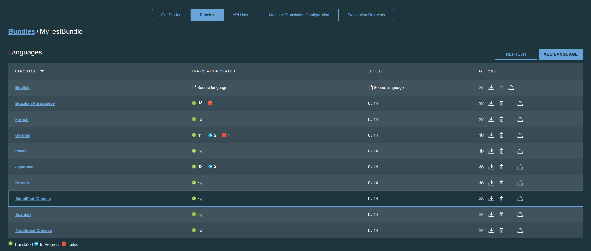

---

copyright:
  years: 2015, 2018
lastupdated: "2017-05-26"

---

{:new_window: target="_blank"}
{:shortdesc: .shortdesc}
{:screen:.screen}
{:codeblock:.codeblock}

# Modifica dei dettagli di un bundle
{: #modifybundles}

Quando apri un bundle puoi visualizzarne tutti i dettagli. Sono elencate tutte le lingue di destinazione presenti nel bundle, con lo stato della traduzione corrente di ognuna di esse.

Lo stato di ogni lingua nel bundle può essere In corso, Non riuscito o Tradotto:

| Stato | Descrizione |
|--------|-------------|
| In corso | La machine translation è ancora in corso. |
| Non riuscito | Si è verificato un errore durante la traduzione del file di risorsa nella lingua di destinazione. |
| Tradotto | La traduzione della lingua di destinazione è completa. |

Puoi aggiornare il file di risorsa che utilizza il bundle, aggiungere una lingua di destinazione al bundle, eliminare una lingua di destinazione da un bundle e scaricare le traduzioni generate per una lingua di destinazione.

## Aggiornamento del file di risorsa utilizzato dal bundle.

1. Affianco alla lingua di origine, fai clic sull'icona **Upload resources**  nella colonna delle azioni.
2. Fai clic su **Browse** e seleziona il nuovo file di risorsa da caricare.
3. Seleziona il tipo di file di risorsa che stai caricando
 * File delle proprietà Java
 * AMD I18N
 * JSON
4. Fai clic su **Update** per caricare il nuovo file di risorsa.

La coppia chiave/valore presente nel nuovo o aggiornato file di risorsa, viene sincronizzata con i valori che erano già stati caricati. Sarà tradotto solo il contenuto nuovo o modificato.

## Aggiunta di una lingua di destinazione a un bundle

1. Fai clic sul pulsante **Add Language**.
2. Vengono visualizzate tutte le lingue di destinazione disponibili. Seleziona le lingue da aggiungere al bundle.

La traduzione delle lingue selezionate inizierà immediatamente.

## Eliminazione di una lingua di destinazione da un bundle

Quando elimini una lingua di destinazione da un bundle, rimuovi la lingua di destinazione e tutte le traduzioni associare dal progetto. Nella colonna delle azioni della lingua di destinazione da rimuovere, fai clic sull'icona **Remove this target language** .

## Scaricamento delle traduzioni generate per una lingua di destinazione.

{{site.data.keyword.GlobalizationPipeline_short}} fornisce varie opzioni per incorporare la traduzione di una lingua di destinazione nella tua applicazione. Puoi scaricare la traduzione come un file di risorsa e includerlo nella creazione della tua applicazione. Puoi anche fare riferimento alla traduzione dinamica dalla {{site.data.keyword.GlobalizationPipeline_short}} utilizzando uno degli [SDK](https://github.com/IBM-Bluemix/gp-common) open source. 

<!-- For information on {{site.data.keyword.GlobalizationPipeline_full}} SDKs, see <link>. -->

Per scaricare la traduzione come un file di risorsa: 

1. Nella colonna **Actions** della lingua di origine o di destinazione da scaricare, fai clic sull'icona **Download the translations** .
2. Seleziona un formato file.
3. Fai clic su **Download**.
