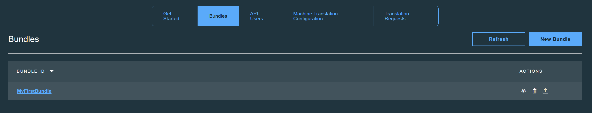

---

copyright:
  years: 2015, 2017
lastupdated: "2017-07-19"

---

{:new_window: target="_blank"}
{:shortdesc: .shortdesc}
{:screen:.screen}
{:codeblock:.codeblock}


# バンドルの操作
{: #globalizationpipeline_workingwithbundles}

作成した各バンドルには、リソース・ファイルから取得されたキー/値ペアと、生成されたすべての翻訳セットが含まれています。
{:shortdesc}

アップロードできるリソース・ファイルの形式は以下のとおりです。ファイルには、アプリの UI 文字列を表すキー/値ペアの形式の内容が含まれていなければなりません。


* ファイル・タイプ: *Java™ プロパティー・ファイル (.properties)*<br>
例:
```js
logout=Logout 
back=Back 
examples=Menu 
home=Home 
web=Web 
enterprise=Enterprise 
extra=Resources 
about=About 
settings=Settings 
help=Help 
support=Support 
topics=Topics 
appExitMsg=Are you sure you want to quit the application?
```
* ファイル・タイプ: *AMD I18N (.js)*<br>
例:
```js
define({
    "root": {
       logout: "Logout",
       back: "Back",
       examples: "Menu",
       home: "Home",
       web: "Web",
       enterprise: "Enterprise",
       extra: "Resources",
       about: "About",
       settings: "Settings",
       help: "Help",
       support: "Support",
       topics: "Topics",
       appExitMsg: "Are you sure you want to quit the application?"
    }
});
``` 
* ファイル・タイプ: *JSON (.json)*<br>
例:
```js
{
  "logout": "Logout",
  "back": "Back",
  "examples": "Menu",
  "home": "Home",
  "web": "Web",
  "enterprise": "Enterprise",
  "extra": "Resources",
  "about": "About",
  "settings": "Settings",
  "help": "Help",
  "support": "Support",
  "topics": "Topics",
  "appExitMsg": "Are you sure you want to quit the application?"
}
``` 

また、リソース・ファイルは以下のガイドラインに従っていなければなりません。
* 各キーの長さは最大 1023 文字。
* 値の長さは最大 8191 文字。
* 1 つのバンドルに含めることができるキー/値ペアは最大 1000 ペア。

作成したバンドルは、**「バンドル」**タブに追加され、そこで言語の追加や削除、翻訳済みコンテンツの表示、翻訳済みコンテンツに対する小規模な編集の実行などの追加タスクを実行できます。 

{{site.data.keyword.GlobalizationPipeline_short}} は、デフォルトの機械翻訳エンジンを使用して、バンドルのコンテンツをその言語に翻訳します。オプションで、[機械翻訳の構成](managetranslations.html#machineconfig)のセクションの説明に従って、別の機械翻訳エンジンを選択することもできます。デフォルトのエンジンでは、以下のターゲット言語がサポートされています。

<table>
<thead>
<tr>
<th>ターゲット言語</th>
</tr>
</thead>
<tbody>
<tr>
<td>中国語 (簡体字)</td>
</tr>
<tr>
<td>中国語 (繁体字)</td>
</tr>
<tr>
<td>フランス語</td>
</tr>
<tr>
<td>ドイツ語</td>
</tr>
<tr>
<td>イタリア語</td>
</tr>
<tr>
<td>日本語</td>
</tr>
<tr>
<td>韓国語</td>
</tr>
<tr>
<td>ポルトガル語 (ブラジル)</td>
</tr>
<tr>
<td>スペイン語</td>
</tr>
</tbody>
</table>

**注:** {{site.data.keyword.GlobalizationPipeline_short}}のデフォルトの機械翻訳エンジンは、ソース言語として英語のサポートのみを提供します。ただし、{{site.data.keyword.GlobalizationPipeline_short}}内の構成で利用可能な別の機械翻訳エンジンは、英語以外の他のソース言語/言語ペアの翻訳をサポートします。

機械翻訳を使用してバンドルのコンテンツを翻訳した後に、{{site.data.keyword.GlobalizationPipeline_short}} 内で小規模な編集を行うことや、人によるレビューと専門翻訳者による編集のためにバンドルを送信することができます。人によるレビューと編集の要求を送信する方法について詳しくは、[Creating chargeable human translation request](managetranslations.html#humantranslation) を参照してください。 


## 操作するバンドルを選択する
{: #globalizationpipeline_selectingabundle}

1. **「バンドル」**タブをクリックして、作成したバンドルをすべて表示します。
2. リストから**「バンドル ID (Bundle ID)」**をクリックして、そのバンドルの詳細を表示します。
または、「アクション」の列にある**「バンドル詳細の表示 (View the bundles detail)」**アイコン 	をクリックします。



操作するバンドルを選択した後、その翻訳のステータスを表示したり、言語を追加/削除したり、翻訳を編集したり、リソース・ファイルを更新したりできます。

不要になったバンドルは、**「バンドル」**タブから削除できます。そのバンドルに関連する翻訳もすべて削除されます。


