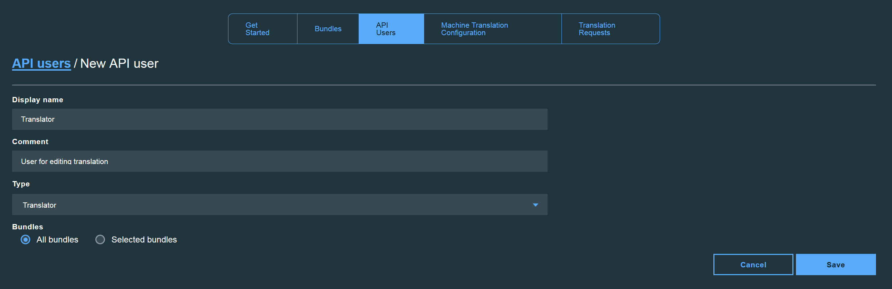

---

copyright:
  years: 2015, 2018
lastupdated: "2017-06-21"

---

{:new_window: target="_blank"}
{:shortdesc: .shortdesc}
{:screen:.screen}
{:codeblock:.codeblock}

# 翻訳の管理
{: #managetranslations}

バンドルを作成してアプリケーションの翻訳の生成を開始した後に、機械翻訳または人による翻訳を選択できます。 機械生成されたコンテンツは、そのまま使用したり、さらに修正して使用したりすることができます。 また、デフォルト以外の機械翻訳を使用することもできます。 このセクションでは、以下の作業について説明します。
<ul>
<li>バンドルの翻訳を実行する機械翻訳エンジンを変更する方法</li>
<li>人による翻訳後の編集を実行する方法</li>
<li>人による翻訳の要求を作成する方法</li>
<li>翻訳へのアクセスが必要な人にユーザー役割とアクセス制限を割り当てる方法</li>
</ul>

**注**: Standard プラン・ユーザーは、人による翻訳要求を作成する場合、Professional プランに切り替えることができます。 人による翻訳要求のデータは Standard プラン内にも引き続き表示されますが、人による翻訳要求を使用できるのは Professional プラン・ユーザーだけです。

## 機械翻訳の構成
{: #machineconfig}

{{site.data.keyword.GlobalizationPipeline_full}}は、バンドルの機械翻訳を実行するために別の機械翻訳サービスと統合する機能をサポートしています。 別のサービスを追加する機能は、{{site.data.keyword.GlobalizationPipeline_short}}で使用されるデフォルトのエンジンでは必要な特定の言語がサポートされていない場合や、別のエンジンで生成される機械翻訳を使用したい場合に便利です。 別のサービスの使用や料金については、そのサービスの利用規約の対象になります。

{{site.data.keyword.GlobalizationPipeline_short}}に別の機械翻訳サービスを追加して構成するには、{{site.data.keyword.GlobalizationPipeline_short}}・ダッシュボードの**「機械翻訳の構成 (Machine Translation Configuration)」**タブを選択します。

* {{site.data.keyword.Bluemix_notm}} カタログに含まれている機械翻訳サービス (**Watson 言語翻訳プログラム**) を追加するために、先にそのサービスを {{site.data.keyword.Bluemix_notm}} スペースに追加しておく必要があります。

* サード・パーティーのサービスを追加するには、**「機械翻訳の構成 (Machine Translation Configuration)」**タブでそのサービスのボタンを選択し、そのサービスへのアクセスに必要なユーザー資格情報を入力します。

機械翻訳サービスが{{site.data.keyword.GlobalizationPipeline_short}}に追加されたら、残りの手順を実行してサービスの統合を完了させます。

1. **「有効にする (Enable)」**をクリックして、そのサービスとの統合をオンにします。

2. 「**言語を更新する (Update Languages)**」をクリックして、サポートされるターゲット言語の更新されたリストを表示します。

3. ターゲット言語のリストから、翻訳を実行する機械翻訳エンジンを選択します。

4. **「保存」**をクリックして、**「機械翻訳の構成 (Machine Translation Configuration)」**タブに戻ります。

{{site.data.keyword.GlobalizationPipeline_short}}に別のサービスが構成されると、そのエンジンに割り当てられているすべてのターゲット言語の生成が、そのエンジンを使用して開始されます。

別の機械翻訳エンジンの使用を停止するには、次のようにします。

1. **「機械翻訳の構成 (Machine Translation Configuration)」**タブで、使用を停止するサービスの**「無効にする (Disable)」**ボタンをクリックします。

別の機械翻訳サービスを無効にしても、そのサービスによって生成された翻訳はすべてバンドル内に残されます。 しかし、現在有効にしている機械翻訳エンジンで特定のターゲット言語がサポートされなくなった場合は、そのターゲット言語への翻訳を今後更新できなくなる可能性があります。

<!-- Review comment: When you disable an engine, do you need to go back and reconfigure the languages?? Does it go back to the default engine? What happens? -->

## 翻訳の表示と編集
{: #edittranslations}

{{site.data.keyword.GlobalizationPipeline_short}}のサービスでは、手作業で翻訳後の編集を行うことができます。 編集して、翻訳の品質や一貫性を向上させたり、より適切な別の言い回しに変更したりできます。 例えば、製品名の訳を上書きしたりする必要が生じることがあります。

ターゲット言語の翻訳を表示して編集するには、次のようにします。

1. **「バンドルの詳細 (Bundle details)」**ページで、ターゲット言語を選択するか、または「アクション」列の**「翻訳の表示 (View the translations)」**アイコン  をクリックします。
2. キー、ソース、翻訳の情報を示した表形式で、翻訳が表示されます。
 * **キー:** リソース・ファイルに含まれている属性 (関連付けられた値があります) を表します。
 * **ソース:** アップロードされたリソース・ファイルに含まれていた翻訳可能ストリングを表します。
 * **翻訳:** ソースの値を翻訳したバージョンを表します。
3. 「アクション」列で、**「翻訳の変更 (Modify the translation)」**アイコン  をクリックし、機械翻訳による値を編集します。
4. 翻訳を編集し、**「更新」**をクリックして、元の翻訳値を、編集した値に更新します。

***ヒント:***
1. 数多くの翻訳可能キーが含まれている大規模なバンドルを操作する場合は、特定の値を見つけることが大変な場合があります。 ターゲット言語翻訳ページの**「検索... (Search for...)」**ボックスを使用すると、すべてのキー、ソース、翻訳の中から素早く検索できます。

2. {{site.data.keyword.GlobalizationPipeline_short}} ダッシュボードには、バンドルの詳細を参照するときに表示される文字列の種類を選択するための、文字列フィルター関数が備わっています。 デフォルトの**「すべての文字列を表示 (Show all strings)」**タブをクリックすると、すべての文字列の表示、レビュー済みの文字列のみの表示、レビューされていない文字列のみの表示から選択できます。

## 人による有料翻訳要求の作成
{: #humantranslation}

品質が重要な場合には、専門の翻訳者に機械翻訳のレビューを要請できます。 {{site.data.keyword.GlobalizationPipeline_short}} の Professional プランで追加料金を支払うことにより、機械翻訳されたバンドルを人によるレビューと編集のために送信することができます。 これを行うには、Standard プランから Professional プランに切り替えて、人による翻訳要求を作成し、ターゲット・バンドルを IBM の専門翻訳サービスに送信できます。 この機能を使用して、翻訳の品質と整合性をさらに高めることができます。 人によるレビューと編集のために使用可能な言語は、{{site.data.keyword.GlobalizationPipeline_short}} で使用可能な機械翻訳エンジンによってサポートされる言語と同じです。

翻訳要求を作成するには、以下の手順を実行します。

1. **{{site.data.keyword.GlobalizationPipeline_short}} Professional プラン**に切り替えます。

2. ダッシュボードの**「翻訳要求 (Translation request)」**タブをクリックして、**「新規要求 (New Request)」**をクリックします。

3. 翻訳のためのターゲット・バンドルとターゲット言語を選択します。

4. 翻訳のためのバンドル ID、ターゲット言語、ソース・ワード・カウントを確認します。

5. ユーザーの要求に関する必要情報を入力します。 アスタリスクでマーク付けされたフィールドに入力する必要があります。

6. 要求を確認して送信します。

**注**: ステップ 5 で、翻訳コンテンツのための追加コンテキストを**「特別な指示 (Special instruction)」**フィールドに入力することが強く推奨されています。これは翻訳者がコンテンツをより良く理解して翻訳結果を品質の高いものにするために役立ちます。

ダッシュボードから、すべての翻訳要求を参照し、ステータスをトラッキングすることができます。

**注**: 各翻訳要求には 5 つの状態があります。 次の表を参照すると、翻訳要求のステータスをトラッキングするために役立ちます。

| 状況 | E メール通知 | 状況の説明 |
|--------|--------------------|--------------------|
| ドラフト  | いいえ | 翻訳要求は作成されましたが、まだ送信されていません。翻訳要求の内容の変更や翻訳要求の削除がまだ可能です。 |
| 送信済み | はい | 翻訳要求は送信されたので、翻訳要求の内容を変更することはできません。|
| 編集開始 | はい | 翻訳要求の人による事後編集作業が開始しました。|
| 編集の完了 | はい | 翻訳要求の人による事後編集作業が完了しました。翻訳文字列が戻されてマスター・リソース文字列にマージされるまで、さらに待つ必要があります。 |
| マージ済み | はい | 人による事後編集の結果が返されてマージされました。翻訳要求は完了しました。 この時点で、レポートを生成できます。 将来の参照用に翻訳要求を保持することも、記憶域を節約するためにそれを削除することもできます。 翻訳要求を削除しても、マージされた翻訳結果に影響はありません。 |

翻訳要求の詳細を表示するには、**「アクション」**列の**「要求の詳細の表示 (View the request detail)」**アイコン  をクリックします。

要求に関する *JSON (.json)* レポートまたは XLIFF を生成するには、**「レポートのダウンロード (Download Report)」**または**「XLIFF のダウンロード (Download XLIFF)」**ボタンをクリックします。

## API ユーザーの追加
{: #adduser}

翻訳を管理していると、追加の API ユーザーに対して、そのユーザーが実行する必要のあるタスクに基づいてアクセスを許可したい場合があります。 例えば、翻訳者には、翻訳の編集を許可する一方でバンドル情報は変更できないようにしたいことがあります。

| **役割タイプ** | **翻訳の表示** | **翻訳の編集** | **バンドル情報の変更** | **プロフェッショナル翻訳要求の作成** | **プロフェッショナル翻訳要求の表示** |
|-----------|--------------------|--------------------|----------------------------|
| リーダー    | はい | いいえ | いいえ | いいえ | いいえ |
| 翻訳者 | はい | はい | いいえ | いいえ | はい |
| 管理者 | はい | はい | はい | はい | はい |

API ユーザーを複数作成する場合は、{{site.data.keyword.GlobalizationPipeline_short}} 認証を使用すると、1 つ以上の特定のバンドルにアクセスを制限することも、使用可能なすべてのバンドルへのアクセスを許可することもできます。

{{site.data.keyword.GlobalizationPipeline_short}}のサービス・インスタンス内のバンドルへのアクセスを API ユーザーに許可するには、次のようにします。

1. {{site.data.keyword.GlobalizationPipeline_short}}のダッシュボードで、**「API ユーザー (API Users)」**タブをクリックします。
2. **「新しい API ユーザー (New API User)」**をクリックします。
3. **「表示名 (display name)」**と**「コメント (comment)」**に、新しい API ユーザーについての内容を入力します。
4. 新しい API ユーザーの**「タイプ」**を選択します。
5. API ユーザーに、すべてのバンドルへのアクセスを許可するのか、選択したバンドルへのアクセスのみを許可するのかを選択します。
6. **「保存」**をクリックします。

API のユーザー ID とパスワードが生成され、表示されます。 それらの資格情報をコピーして保存します。ウィンドウを閉じた後にそれらを再び取得することはできません。 資格情報は、[SDK](https://github.com/IBM-Bluemix/gp-common) を介して RESTful サービスで使用できます。

API ユーザー・パスワードをリセットするには、次のようにします。

1. {{site.data.keyword.GlobalizationPipeline_short}}のダッシュボードで、**「API ユーザー (API Users)」**タブをクリックします。
2. **「パスワードのリセット (Reset Password)」**アイコン  をクリックし、特定のユーザー ID のパスワードをリセットします。
3. **「はい (Yes)」**をクリックします。
