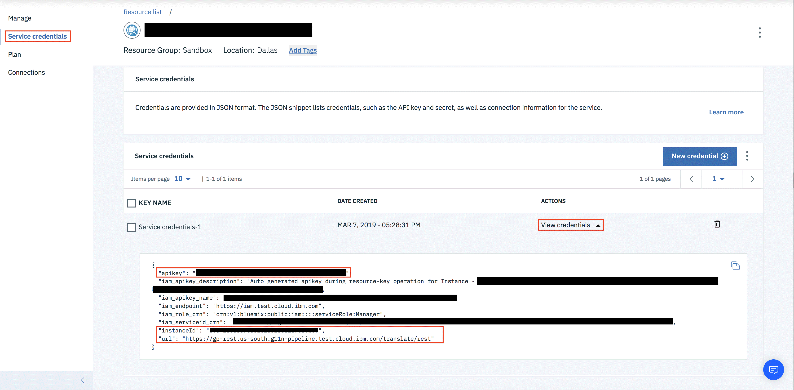

---

copyright:
  years:  2015, 2019
lastupdated: "2019-03-25"

---

{:new_window: target="_blank"}
{:shortdesc: .shortdesc}
{:screen: .screen}
{:pre: .pre}
{:table: .aria-labeledby="caption"}
{:codeblock: .codeblock}
{:tip: .tip}
{:download: .download}


# {{site.data.keyword.GlobalizationPipeline_short}}에 대한 IBM Cloud IAM
{: #gp_iam}

## 액세스
{: #gp_iam_access}
계정 내 사용자의 {{site.data.keyword.GlobalizationPipeline_short}} RC 사용 서비스 인스턴스에 대한 액세스는 {{site.data.keyword.Bluemix_notm}} Identity and Access Management(IAM) 및/또는 {{site.data.keyword.GlobalizationPipeline_short}} 인증에 의해 제어됩니다. 반면 CF 인스턴스의 경우에는 {{site.data.keyword.GlobalizationPipeline_short}} 인증만 사용할 수 있습니다. 

## {{site.data.keyword.GlobalizationPipeline_short}} 인증
{: #gp_iam_ca}
인증 메커니즘을 사용하려면 [API 사용자 추가](/docs/services/GlobalizationPipeline/managetranslations.html#adduser)를 참조하십시오. 


## Identity Access Management(IAM)
{: #gp_iam_ovw}
계정 내에서 {{site.data.keyword.GlobalizationPipeline_short}} 서비스에 액세스하는 모든 사용자에게는 IAM 사용자 역할이 정의된 액세스 정책이 지정되어야 합니다. 이 정책은 선택된 서비스 또는 인스턴스의 컨텍스트 내에서 해당 사용자가 수행할 수 있는 조치를 결정합니다. 허용 가능한 조치는 서비스에 대해 수행하도록 허용되는 오퍼레이션으로서 {{site.data.keyword.Bluemix_notm}} 서비스에 의해 사용자 정의되고 정의됩니다. 그 후 이러한 조치는 IAM 사용자 역할에 맵핑됩니다. 

정책은 다양한 레벨로 액세스 권한을 부여할 수 있도록 합니다. 일부 옵션은 다음 항목을 포함합니다.  

* 계정 내 특정 서비스의 모든 인스턴스에 대한 액세스 권한
* 계정 내 개별 서비스 인스턴스에 대한 액세스 권한
* 인스턴스 내 특정 리소스에 대한 액세스 권한
* 계정 내 모든 IAM 사용 서비스에 대한 액세스 권한

액세스 정책의 범위를 정의한 후에는 역할을 지정합니다. 다음 표에는 서비스 액세스 역할에 맵핑되는 조치가 자세히 설명되어 있습니다. 서비스 액세스 역할은 {{site.data.keyword.GlobalizationPipeline_short}}, 그리고 {{site.data.keyword.GlobalizationPipeline_short}}의 API를 호출하는 기능에 대한 사용자 액세스를 가능하게 합니다. 

| **역할 유형** | **번역 보기** | **번역 편집** | **번들 정보 수정** | **전문 번역 요청 작성** | **전문 번역 요청 보기** |
|---------------|-----------------------|-----------------------|-------------------------------|----------------------------------------------|--------------------------------------------|
|독자        |예 |아니오 |아니오 |아니오 |아니오 |
|작성자      |예 |예 |아니오 |아니오 |예 |
|관리자      |예 |예 |예 |예 |예 |
{: caption="표 1. IAM 사용자 역할 및 조치" caption-side="top"}

현재 IAM 사용자는 서비스 인스턴스 레벨에서 액세스 권한이 부여되며, 번들 레벨에서 IAM 사용자에게 액세스를 허용하거나 거부할 수는 없습니다. 세분화된 제어를 위해서는 {{site.data.keyword.GlobalizationPipeline_short}} 인증을 사용하십시오. 

UI에서 사용자 역할을 지정하는 데 대한 정보는 [IAM 액세스 관리](/docs/iam/iammanidaccser.html#iammanidaccser)를 참조하십시오. 

### API 호출 생성
{: #gp_iam_apicalls}

서비스 인증 정보를 생성하거나 가져오려면 다음 단계를 따르십시오. 
1. [{{site.data.keyword.Bluemix}} 대시보드](https://cloud.ibm.com/)에서 {{site.data.keyword.Bluemix}} 계정에 로그온하십시오. 
2. [{{site.data.keyword.Bluemix}} 대시보드](https://cloud.ibm.com/)에서 서비스 인스턴스를 클릭하십시오. 
3. **서비스 인증 정보**를 클릭하여 서비스 인스턴스를 여십시오.  
4. **새 인증 정보**를 클릭하여 프롬프트에 따라 새 인증 정보를 작성하십시오. 
5. 인증 정보를 작성한 후 **인증 정보 보기**를 클릭하십시오.


다음 내용은 IAM 인증을 사용하여 {{site.data.keyword.GlobalizationPipeline_short}}의 API를 호출하는 예입니다. 

* IAM Bearer 토큰 사용
```
curl -X GET \
  https://gp-rest.us-south.g11n-pipeline.test.cloud.ibm.com/translate/rest/50341556337c581c208188ff8908ebc7/v2/bundles \
  -H 'Authorization: Bearer eyJjsksd…w'
```

* API 키 사용
```
curl -X GET \
  https://gp-rest.us-south.g11n-pipeline.test.cloud.ibm.com/translate/rest/50341556337c581c208188ff8908ebc7/v2/bundles \
  -H 'Authorization: API-KEY MklfrP…ACem'
```
이전 예에서는 다음 정보를 얻을 수 있습니다.
* “50341556337c581c208188ff8908ebc7”은 인스턴스 ID(인증 정보 섹션의)입니다. 
* “https://gp-rest.us-south.g11n-pipeline.test.cloud.ibm.com/translate/rest”은 URL(인증 정보 섹션의)입니다. 
* “MklfrP…ACem”은 API 키(인증 정보 섹션의)입니다. 
* “eyJjsksd…w”는 IAM Bearer 토큰입니다. 

API 키에서 IAM Bearer 토큰을 가져오는 데 대한 지시사항은 [API 키를 사용하여 {{site.data.keyword.Bluemix_notm}} IAM 토큰 가져오기](/docs/iam?topic=iam-iamtoken_from_apikey#iamtoken_from_apikey)를 참조하십시오. 
