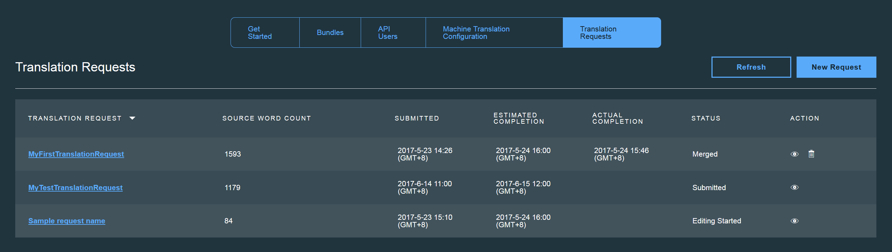
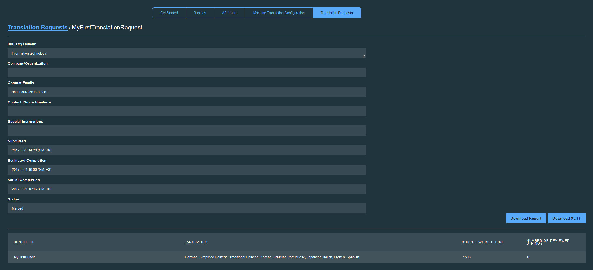

---

copyright:
  years: 2015, 2017
lastupdated: "2017-07-19"

---

{:new_window: target="_blank"}
{:shortdesc: .shortdesc}
{:screen:.screen}
{:codeblock:.codeblock}

# 번역 관리
{: #managetranslations}

번들을 작성하고 애플리케이션에 대한 번역 생성을 시작하고 나면 기계 번역과 인간 번역 중에서 선택할 수 있습니다. 기계에서 생성한 컨텐츠는 현상태 그대로 사용하거나 추가로 수정할 수 있습니다. 기본값 외에 기계 번역을 사용하도록 선택할 수도 있습니다. 이 섹션에서는 다음 태스크에 대한 지시사항을 다룹니다.
<ul>
<li>번들의 번역을 수행하는 기계 번역 엔진을 변경하는 방법</li>
<li>인간 번역 후 편집을 수행하는 방법</li>
<li>인간 번역 요청을 작성하는 방법</li>
<li>번역에 액세스해야 하는 사용자에 대한 사용자 역할과 액세스 제한사항을 지정하는 방법</li>
</ul>

**참고**: Standard 플랜 사용자가 인간 번역 요청을 작성하려는 경우 Professional 플랜으로 전환할 수 있습니다. Standard 플랜에서 여전히 인간 번역 요청 데이터를 볼 수 있지만 인간 번역 요청은 Professional 플랜 사용자만 사용할 수 있습니다. 

## 기계 번역 구성
{: #machineconfig}

{{site.data.keyword.GlobalizationPipeline_full}}에서는 대체 기계 번역 서비스를 통합하는 기능을 지원하여 번들에 대해 기계 번역을 수행합니다. {{site.data.keyword.GlobalizationPipeline_short}}에서 활용되는 기본 엔진이 필요한 특정 언어를 제공하지 않는 경우나 다른 엔진에서 생성되는 기계 번역을 선호하는 경우 대체 서비스를 추가하면 유용할 수 있습니다. 대체 서비스의 사용 및 담당은 해당 서비스의 이용 약관에 따릅니다.

{{site.data.keyword.GlobalizationPipeline_short}}에 대해 대체 기계 번역 서비스를 추가하고 구성하려면 {{site.data.keyword.GlobalizationPipeline_short}} 대시보드에서 **기계 번역 구성** 탭을 선택하십시오.

* {{site.data.keyword.Bluemix_notm}} 카탈로그에 있는 기계 번역 서비스(**Watson 언어 번역기**)를 추가하려면 먼저 서비스를 {{site.data.keyword.Bluemix_notm}} 영역에 추가해야 합니다.

* 써드파티 서비스를 추가하려면 **기계 번역 구성** 탭의 해당 서비스 단추를 선택하고 서비스에 액세스하는 데 필요한 사용자 신임 정보를 제공하십시오.

기계 번역 서비스가 {{site.data.keyword.GlobalizationPipeline_short}}에 추가된 후 나머지 단계를 수행하여 해당 서비스의 통합을 완료하십시오.

1. **사용**을 클릭하여 해당 서비스와의 통합을 켜십시오.

2. **언어 업데이트**를 클릭하여 지원되는 대상 언어의 업데이트된 목록을 보십시오.

3. 대상 언어의 목록에서 번역을 수행해야 하는 기계 번역 엔진을 선택하십시오.

4. **저장**을 클릭하여 **기계 번역 구성** 탭으로 돌아가십시오.

대체 서비스가 {{site.data.keyword.GlobalizationPipeline_short}}과 함께 구성되었으면 해당 엔진에 지정된 모든 대상 언어가 해당 엔진을 통해 생성되기 시작합니다. 

대체 기계 번역 엔진 사용을 중지하려면 다음을 수행하십시오.

1. **기계 번역 구성** 탭에서 사용을 중지할 서비스에 대한 **사용 안함** 단추를 클릭하십시오.

대체 기계 번역 서비스를 사용 안함으로 설정하면 서비스에서 생성된 모든 번역이 번들 내에 남습니다. 그러나 특정 대상 언어로의 번역은 현재 사용으로 설정한 기계 번역 엔진에서 대상 언어를 지원하지 않는 경우 향후 업데이트에 사용하지 못할 수 있습니다. 

<!-- Review comment: When you disable an engine, do you need to go back and reconfigure the languages?? Does it go back to the default engine? What happens? -->

## 번역 보기 및 편집
{: #edittranslations}

{{site.data.keyword.GlobalizationPipeline_short}} 서비스에서 번역 후 직접 편집 기능을 제공합니다. 번역의 품질 또는 일관성을 향상시키고 다른 단어로 대체하도록 편집할 수 있습니다. 예를 들어, 제품 이름의 번역을 겹쳐써야 할 수 있습니다.

대상 언어에 대해 번역을 보고 편집하려면 다음을 수행하십시오.

1. **번들 세부사항** 페이지에서 대상 언어를 선택하거나 **번역 보기** 아이콘 을 조치 열에서 클릭하십시오.
2. 키, 소스 및 번역 정보를 표시하는 테이블에 번역이 표시됩니다.
 * **키:** 연관된 값이 있는 리소스 파일에 속성을 나타냅니다.
 * **소스:** 업로드된 리소스 파일에 포함된 번역 가능한 문자열을 나타냅니다.
 * **번역:** 소스 값의 번역된 버전을 나타냅니다.
3. 조치 열에서 **번역 수정** 아이콘 을 클릭하여 기계 번역 값을 편집하십시오.
4. 번역을 편집하고 **업데이트**를 클릭하여 기존의 번역된 값을 편집으로 업데이트하십시오.

 

***팁:*** 
1. 번역 가능한 여러 개의 키를 포함하는 대형 번들에 대해 작업하는 경우 특정 값을 찾는 것이 어려울 수 있습니다. 대상 언어 번역 페이지에서 **검색...** 상자를 사용하여 모든 키, 소스 및 번역을 빠르게 검색할 수 있습니다.
 

2. {{site.data.keyword.GlobalizationPipeline_short}} 대시보드에서는 번들 세부사항을 볼려는 경우 표시할 문자열 유형을 선택하는 문자열 필터 기능을 제공합니다. 기본 **문자열 모두 표시** 탭을 클릭하면 모든 문자열 표시, 검토한 문자열만 표시 또는 검토하지 않은 문자열만 표시 중에서 선택할 수 있습니다.

## 비용이 청구되는 인간 번역 요청 작성
{: #humantranslation}

품질이 최우선인 경우 전문 번역가를 고용하여 기계 번역을 검토하게 할 수 있습니다. {{site.data.keyword.GlobalizationPipeline_short}}의 Professional 플랜에서는 추가 비용을 내면 인간이 검토하고 편집하도록 기계 번역 번들을 제출할 수 있습니다. 이 작업을 수행하려면 Standard 플랜에서 Professional 플랜으로 전환하고, 인간 번역 요청을 작성하여 대상 번들을 IBM의 전문가 번역 서비스에 제출하십시오. 이 기능을 사용하여 번역의 품질과 일관성을 더욱 개선할 수 있습니다. 인간 검토 및 편집에 사용 가능한 언어는 {{site.data.keyword.GlobalizationPipeline_short}}을 통해 사용 가능한 기계 번역 엔진에서 지원되는 언어와 같습니다. 

번역 요청을 작성하려면 다음 단계를 완료하십시오. 

1. **{{site.data.keyword.GlobalizationPipeline_short}} Professional 플랜**으로 전환하십시오.

2. 대시보드에서 **번역 요청** 탭을 클릭하고 **새 요청**을 클릭하십시오.

3. 번역의 대상 번들과 대상 언어를 선택하십시오. 

4. 번역할 번들 ID, 대상 언어 및 소스 단어 수를 확인하십시오. 

5. 요청에 대한 필수 정보를 제공하십시오. 별표로 표시된 필드는 반드시 입력해야 합니다.

6. 요청을 확인한 후 제출하십시오.

**참고**: 5단계에서 **특별 지시사항** 필드에 번역 컨텐츠의 추가 컨텍스트를 제공하는 것이 좋습니다. 이를 통해 인간 번역자가 컨텐츠를
보다 정확히 이해하여 우수한 품질의 번역 결과를 제공할 수 있습니다. 

대시보드에서 모든 번역 요청을 확인하고 해당 상태를 추적할 수 있습니다.

**참고**: 각 번역 요청에는 5가지 상태가 있습니다. 다음 테이블을 참조하여 번역 요청의 상태를 추적할 수 있습니다.

| 상태   | 이메일 알림        | 상태 설명          |
|--------|--------------------|--------------------|
| 초안   | 아니오             | 번역 요청이 작성되었지만 아직 제출되지 않았습니다. 여전히 번역 요청의 컨텐츠를 수정하거나 번역 요청을 삭제할 수 있습니다. |
| 제출됨 | 예                 | 번역 요청이 제출되었으므로 번역 요청의 컨텐츠를 수정할 수 없습니다.|
| 편집 시작됨 | 예            | 번역 요청에 대한 인간 사후 편집 작업이 시작되었습니다. |
| 편집 완료됨 | 예            | 번역 요청에 대한 인간 사후 편집 작업이 완료되었습니다. 번역된 문자열이 마스터 리소스 문자열에 병합될 때까지 계속 대기해야 합니다. |
| 병합됨 | 예                 | 인간 사후 편집 결과가 다시 병합되었습니다. 번역 요청이 완료되었습니다. 이때 보고서를 생성할 수 있습니다. 나중에 참조하도록 번역 요청을 보관하거나, 스토리지 절약을 위해 번역 요청을 삭제할 수 있습니다. 번역 요청을 삭제해도 병합된 번역 결과에 영향을 미치지 않습니다. |

번역 요청 세부사항을 보려면 **조치** 열에서 **요청 세부사항 보기** 아이콘 을 클릭하십시오. 

요청에 대한 *JSON(.json)* 보고서나 XLIFF를 보려면 **보고서 다운로드** 또는 **XLIFF 다운로드** 단추를 클릭하십시오.

## API 사용자 추가
{: #adduser}

번역을 관리하면, 수행해야 하는 태스크를 기준으로 추가 API 사용자에게 액세스 권한을 부여해야 할 수 있습니다. 예를 들어, 번역사가 번역은 편집할 수 있지만 번들 정보는 수정할 수 없게 할 수 있습니다.

| 역할 유형 | 번역 보기 가능     | 번역 편집 가능     | 번들 정보 수정 가능        |
|-----------|--------------------|--------------------|----------------------------|
| 독자      | 예                 | 아니오             | 아니오                     |
| 번역자    | 예                 | 예                 | 아니오                     |
| 관리자    | 예                 | 예                 | 예                         |

추가 API 사용자를 작성하는 경우 다수의 특정 번들에 대해 액세스 권한을 제한하거나 모든 사용 가능한 번들에 대해 액세스 권한을 부여할 수 있습니다.

{{site.data.keyword.GlobalizationPipeline_short}} 서비스 인스턴스에서 번들에 API 사용자 액세스 권한을 부여하려면 다음을 수행하십시오.

1. {{site.data.keyword.GlobalizationPipeline_short}} 대시보드에서 **API 사용자** 탭을 클릭하십시오.
2. **새 API 사용자**를 클릭하십시오.
3. **표시 이름** 및 **주석**을 입력하여 새 API 사용자에 대해 설명하십시오.
4. 새 API 사용자의 **유형**을 선택하십시오.
5. 모든 번들 또는 선택된 번들에만 API 사용자 액세스 권한을 제공하도록 선택하십시오.
6. **저장**을 클릭하십시오.

API 사용자 ID 및 비밀번호가 생성되고 표시됩니다. 해당 신임 정보를 복사하고 저장하십시오. 창을 닫으면 다시 여기에 액세스할 수 없습니다. 신임 정보는 [SDK](https://github.com/IBM-Bluemix/gp-common)를 통해 RESTful 서비스에 사용될 수 있습니다. 

API 사용자 비밀번호를 재설정하려면 다음을 수행하십시오.

1. {{site.data.keyword.GlobalizationPipeline_short}} 대시보드에서 **API 사용자** 탭을 클릭하십시오.
2. **비밀번호 재설정** 아이콘 을 클릭하여 특정 사용자 ID의 비밀번호를 재설정하십시오. 
3. **예**를 클릭하십시오. 
