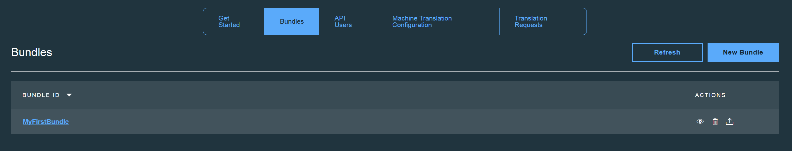

---

copyright:
  years: 2015, 2018
lastupdated: "2017-06-16"

---

{:new_window: target="_blank"}
{:shortdesc: .shortdesc}
{:screen:.screen}
{:codeblock:.codeblock}


# 使用組合
{: #globalizationpipeline_workingwithbundles}

您建立的每一個組合都會包含資源檔中的鍵值組，以及一組已產生的完整翻譯。
{:shortdesc}

您上傳的資源檔可以是下列任何格式，而且必須包含代表應用程式中使用者介面字串之鍵值組形式的內容。


* 檔案類型：*Java™ Properties 檔案 (.properties)*<br>
範例：
```js
logout=Logout 
back=Back 
examples=Menu 
home=Home 
web=Web 
enterprise=Enterprise 
extra=Resources 
about=About 
settings=Settings 
help=Help 
support=Support 
topics=Topics 
appExitMsg=Are you sure you want to quit the application?
```
* 檔案類型：*AMD I18N (.js)*<br>
範例：
```js
define({
    "root": {
       logout: "Logout",
       back: "Back",
       examples: "Menu",
       home: "Home",
       web: "Web",
       enterprise: "Enterprise",
       extra: "Resources",
       about: "About",
       settings: "Settings",
       help: "Help",
       support: "Support",
       topics: "Topics",
       appExitMsg: "Are you sure you want to quit the application?"
    }
});
```
* 檔案類型：*JSON (.json)*<br>
範例：
```js
{
  "logout": "Logout",
  "back": "Back",
  "examples": "Menu",
  "home": "Home",
  "web": "Web",
  "enterprise": "Enterprise",
  "extra": "Resources",
  "about": "About",
  "settings": "Settings",
  "help": "Help",
  "support": "Support",
  "topics": "Topics",
  "appExitMsg": "Are you sure you want to quit the application?"
}
```

此外，資源檔也必須遵循下列準則：
* 每一個索引鍵最多可以有 1023 個字元。
* 每一個值最多可以有 8191 個字元。
* 每一個組合最多可以包含 1000 個鍵值組。

當您建立組合時，它們會新增到**組合**標籤中，您可在該標籤中執行其他作業，如新增或刪除語言、檢視已翻譯的內容，以及對已翻譯的內容進行一些小修改。 

{{site.data.keyword.GlobalizationPipeline_short}} 會使用預設的機器翻譯引擎，將您的組合內容翻譯成各語言。您可以選擇性地選擇替代機器翻譯引擎（如[機器翻譯配置](/docs/services/GlobalizationPipeline/managetranslations.html#machineconfig)小節中所述）。預設引擎支援下列目標語言：

<table>
<thead>
<tr>
<th>目標語言</th>
</tr>
</thead>
<tbody>
<tr>
<td>簡體中文</td>
</tr>
<tr>
<td>繁體中文</td>
</tr>
<tr>
<td>法文</td>
</tr>
<tr>
<td>德文</td>
</tr>
<tr>
<td>義大利文</td>
</tr>
<tr>
<td>日文</td>
</tr>
<tr>
<td>韓文</td>
</tr>
<tr>
<td>葡萄牙文 (巴西)</td>
</tr>
<tr>
<td>西班牙文</td>
</tr>
</tbody>
</table>

**附註：**{{site.data.keyword.GlobalizationPipeline_short}} 的預設機器翻譯引擎只提供以英文作為原始語言的支援。不過，可在 {{site.data.keyword.GlobalizationPipeline_short}} 內配置替代機器翻譯引擎，這些引擎支援翻譯非英文的原始語言/語言配對。

使用機器翻譯翻譯好您的組合內容之後，您可以在 {{site.data.keyword.GlobalizationPipeline_short}} 內進行細微的編輯，或是將組合送出由專業譯者進行人工檢閱與編輯。如需提供人工檢閱與編輯之要求的詳細資料，請參閱[建立可收費的人工翻譯要求](/docs/services/GlobalizationPipeline/managetranslations.html#humantranslation)。


## 選取要使用的組合
{: #globalizationpipeline_selectingabundle}

1. 按一下**組合**標籤，以檢視所有已建立的組合。
2. 按一下清單中的**組合 ID** 以查看組合的其他詳細資料，或按一下「動作」直欄中的**檢視組合詳細資料**圖示 。



選取要使用的組合之後，您即可檢視其翻譯的狀態、新增或移除語言、編輯翻譯，或提供資源檔的更新。

如果您不再需要某組合，則可以從**組合**標籤中將它刪除。這會一併刪除與組合相關聯的所有翻譯。
